# Light Scalars at FASER

Felix Kling,b Shuailong Li,c Huayang Song,d,1 Shufang Suc and Wei Sua,2

aSchool of Science, Shenzhen Campus of Sun Yat-sen University, No. 66, Gongchang Road, Guangming District, Shenzhen, Guangdong 518107, P.R. China   
bDeutsches Elektronen-Synchrotron DESY, Notkestr. 85, 22607 Hamburg, Germany   
cDepartment of Physics, University of Arizona, Tucson, AZ 85721, U.S.A.   
dCAS Key Laboratory of Theoretical Physics, Institute of Theoretical Physics, Chinese Academy of Sciences, Beijing 100190, China

E-mail: felix.kling@desy.de, shuailongli@email.arizona.edu, huayangs@itp.ac.cn, shufang@email.arizona.edu, suwei26@mail.sysu.edu.cn

Abstract: FASER, the ForwArd Search ExpeRiment, is a currently operating experiment at the Large Hadron Collider (LHC) that can detect light long-lived particles produced in the forward region of the LHC interacting point. In this paper, we study the prospect of detecting light CP-even and CP-odd scalars at FASER and FASER 2. Considering a model-independent framework describing the most general interactions between a CP-even or CP-odd scalar and SM particles using the notation of coupling modifiers in the effective Lagrangian, we develop the general formalism for the scalar production and decay. We then analyze the FASER and FASER 2 reaches of light scalars in the large tan $\beta$ region of the Type-I two Higgs double model as a case study, in which light scalars with relatively long lifetime could be accommodated. In the two benchmark scenarios we considered, the light (pseudo)scalar decay length varies in $( 1 0 ^ { - 8 } , 1 0 ^ { 5 } )$ meters. Both FASER and FASER 2 can probe a large part of the parameter space in the large tan $\beta$ region up to $1 0 ^ { 7 }$ , extending beyond the constraints of the other existing experiments.

Keywords: Multi-Higgs Models, New Light Particles, Specific BSM Phenomenology

ArXiv ePrint: 2212.06186

# Contents

# 1 Introduction 1

# 2 Light CP-even scalar 3

2.1 Effective Lagrangian 3   
2.2 Productions 4   
2.3 Decays of light CP-even scalar 6

# 3 Light CP-odd scalar 7

3.1 Effective Lagrangian 7   
3.2 Productions 8   
3.3 Decays of light CP-odd scalar 9

# 4 Case study: Type-I two Higgs doublet model 11

4.1 Model and couplings 11   
4.2 Theoretical and experimental constraints 12   
4.2.1 Unitarity and vacuum stability 12   
4.2.2 Electroweak precision constraints 14   
4.2.3 Flavor constraints 14   
4.2.4 Invisible Higgs decays 14   
4.2.5 Other experimental constraints 15

4.3 FASER and FASER2 16   
4.4 Results for the light CP-even Higgs in the Type-I 2HDM 18   
4.5 Results for the light CP-odd Higgs in the Type-I 2HDM 20

# 5 Conclusion 22

A Form factors $A _ { \mathbf { 0 } , \mathbf { 1 } / \mathbf { 2 } , \mathbf { 1 } }$ 23   
B Formulae related to tri-meson decay of CP-odd scalar 23   
C Tri-Higgs couplings 24   
D Auxiliary functions for the 2HDM 25   
E Double (pseudo)scalars production in the Type-I 2HDM 25

# 1 Introduction

Searches for beyond the Standard Model (SM) new particles are one of main physics drivers at the Large Hadron Collider (LHC) after the discovery of the SM-like Higgs. Traditional resonance searches at the LHC main detectors, like ATLAS and CMS, are aimed at promptly decaying particles with electroweak-scale masses and O(1) couplings to the SM particles.

Recently there are increasing interests in the detection of long-lived particles (LLPs) at the LHC main detectors ATLAS and CMS [1–26], MATHUSLA [4, 10, 27–38], CodexB [39–42], ANUBIS [43–45], etc. However, those searches are mostly sensitive to particles produced in the transverse region. For the light LLPs produced mostly in the forward region, the sensitivity is greatly reduced.

Light LLPs with mass a few GeV or lighter are predicted in many new physics scenarios [46–51], in particular, those involve dark matter [52–58], hidden valley [59, 60], dark photon [61–64], axion-like particles [65–68] or heavy neutral leptons [69–74]. There are several undergoing and proposed experiments for light LLPs searches, including Belle-II [75– 77], FNAL-µ [78, 79], HPS [80–82], NA62 [83, 84], NA64 [85–88], $\mathrm { N A 6 4 } _ { e } ^ { + + }$ [89], $\mathrm { N A 6 4 } _ { \mu }$ [90], SeaQuest [91, 92], SpinQuest/DarkQuest [93–96], LongQuest [97], and SHiP [98–100]. Those light particles could also be copiously produced in the forward region of a high energy collider, for example, the LHC. FASER, the ForwArd Search ExpeRiment, is designed to detect LLPs produced at the ATLAS interaction point (IP), traveling in the very forward region, and decaying in FASER (480 meters from the IP) into two very energetic particles [101–106]. FASER has been taking data since summer, 2022. Given the distinctive signature and low background environment, FASER provides a unique opportunity to probe light particles with suppressed couplings [101, 103, 107, 108], for example, dark photons [101], axion-like particles [109], and heavy neutral leptons [110]. At the HL-LHC, FASER will be upgraded to FASER 2 with a larger volume of the detector, potentially at the same location [107] or at the Forward Physics Facility (FPF) [111, 112]. In this paper, we explore the collider reach of light long lived scalars at FASER and FASER 2 experiments.

The simplest extension of the SM with a long-lived scalar is the dark Higgs scenario in which a new singlet scalar S mixes with the SM Higgs with the mixing angle θ. The couplings of the new physical scalar with SM particles follow those of the SM Higgs, rescaled by sin θ at leading order. Previous studies of this scenario at FASER show significant sensitivity to a light long-lived scalar [107, 109, 113, 114]. However, these studies are quite limited given the specific coupling structure of the light scalar with SM particles.

In this work we consider a model-independent framework describing the most general interactions between a CP-even or CP-odd scalar and SM particles using the notation of coupling modifiers in the effective Lagrangian. We develop general formalism for the productions of the light scalar from meson decays, as well as re-analyse the scalar decay rates. Given the non-universal couplings of the scalar to SM particles, the light scalar behaves much more complicatedly compared to the one in the simplest dark Higgs scenario. The CP-odd scalar can further mix with the light meson states, resulting in more nonstandard features. We evaluate the decays of the light scalars to diphotons, dileptons, as well as hadronic final states. In particular, for mass below about 2 GeV, we adopt chiral perturbation theory and dispersive analysis to calculate the hadronic decay of light scalars. For heavier masses, the spectator model is applied. We develop a program [115] to calculate the decays of a light CP-even or CP-odd scalar across a wide mass range, incorporating the coupling modifiers of the light scalars to the SM particles. Our program can be applied to various new physics models with a light scalar.

Sub-GeV scalar arises in various well-studied models, such as the two Higgs doublet model (2HDM) [116], the Next-to-Minimal 2HDM (N2HDM) [48] and the Next-to-Minimal

Supersymmetric Standard Model (NMSSM) [117]. As a case study, we apply our general formalism on the productions and decays of light scalars in the framework of the 2HDMs. After considering both theoretical and experimental constraints on the 2HDMs, we find that the most viable scenario that could accommodate a light long lived scalar is the large tan $\beta$ region of the Type-I 2HDM. We identify two specific benchmark regions that could accommodate a long-lived light scalar or pseudoscalar. We further analyze the reach of FASER and FASER 2 on the parameter space of the Type-I 2HDM for theses two benchmark regions.

The paper is organized as follows. In section 2 we introduce the general interactions of CP-even scalar and discuss the production and decays of a light CP-even scalar. We present the study for the light CP-odd scalar in section 3, emphasizing the special features due to its mixing with meson states. Our case study of the large tan $\beta$ region of the Type-I 2HDM and main results are presented in section 4. We conclude in section 5. Expressions for loop-induced form factors, tri-meson decay amplitudes, tri-Higgs couplings, effective flavor changing couplings of (pseudo)scalars, as well as the double (pseudo)scalars production in the Type-I 2HDM are collected in the appendix.

# 2 Light CP-even scalar

# 2.1 Effective Lagrangian

The effective Lagrangian for a (light) CP-even scalar $\phi$ interacting with SM particles can be written as [118]

$$
\begin{array}{l} \mathcal {L} = - \frac {1}{2} m _ {\phi} ^ {2} \phi^ {2} - \sum_ {f} \xi_ {\phi} ^ {f} \frac {m _ {f}}{v} \phi \bar {f} f + \xi_ {\phi} ^ {W} \frac {2 m _ {W} ^ {2}}{v} \phi W ^ {\mu +} W _ {\mu} ^ {-} + \xi_ {\phi} ^ {Z} \frac {m _ {Z} ^ {2}}{v} \phi Z ^ {\mu} Z _ {\mu} \\ + \xi_ {\phi \phi} ^ {W} \frac {g ^ {2}}{4} \phi \phi W ^ {\mu +} W _ {\mu} ^ {-} + \xi_ {\phi \phi} ^ {Z} \frac {g ^ {2}}{8 \cos^ {2} \theta_ {W}} \phi \phi Z ^ {\mu} Z _ {\mu} + \xi_ {\phi} ^ {g} \frac {\alpha_ {s}}{1 2 \pi v} \phi G _ {\mu \nu} ^ {a} G ^ {a \mu \nu} + \xi_ {\phi} ^ {\gamma} \frac {\alpha_ {\mathrm{ew}}}{4 \pi v} \phi F _ {\mu \nu} F ^ {\mu \nu}, \tag {2.1} \\ \end{array}
$$

where $\theta _ { W }$ is the Weinberg angle and $F _ { \mu \nu }$ and $G _ { \mu \nu } ^ { a }$ denote the field-strength tensors for the photon and gluon fields respectively. Various $\xi \mathrm { s }$ are the coupling modifiers for the interactions between $\phi$ and SM particles.

In the SM, the effective couplings φgg and $\phi \gamma \gamma$ are loop generated. The contribution of quarks, leptons and W bosons to $\xi _ { \phi } ^ { g }$ and $\xi _ { \phi } ^ { \gamma }$ are given by [119–121]

$$
\xi_ {\phi} ^ {g} = \sum_ {f \in q} \frac {3}{2} \xi_ {\phi} ^ {i} \mathcal {A} _ {1 / 2} ^ {\phi} (\tau_ {f} ^ {\phi}), \tag {2.2}
$$

$$
\xi_ {\phi} ^ {\gamma} = \sum_ {f \in q, \ell} N _ {c} Q _ {f} ^ {2} \xi_ {\phi} ^ {f} \mathcal {A} _ {1 / 2} ^ {\phi} (\tau_ {f} ^ {\phi}) + \xi_ {\phi} ^ {V} \mathcal {A} _ {1} ^ {\phi} (\tau_ {W} ^ {\phi}). \tag {2.3}
$$

Here $\tau _ { i } ^ { \phi } = m _ { \phi } ^ { 2 } / 4 m _ { i } ^ { 2 }$ and $m _ { i }$ is the mass of the particle running in the loop. The expressions for the form factors $\mathcal { A } _ { 1 / 2 , 1 } ^ { \phi }$ for fermions and gauge bosons can be found in appendix A. For new physics models with new charged/colored particles coupling to $\phi ,$ , additional contributions to $\xi _ { \phi } ^ { \gamma }$ and $\xi _ { \phi } ^ { g }$ are possible.

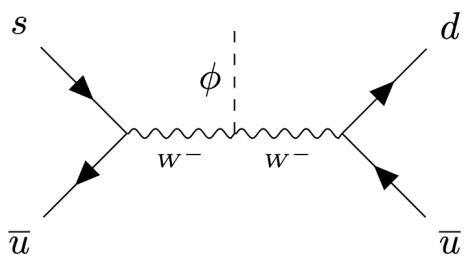

chemical

Feynman diagram showing quark-antiquark interaction with s, d, and ū labels

Figure 1. SM contribute to the transition $K ^ { - }  \pi ^ { - } \phi$ via effective four quark operator.

# 2.2 Productions

Light scalar $\phi$ is mainly produced in the decay of hadrons [46, 113, 122–126], the semileptonic decays of pions and kaons [113, 127], as well as radiative bottomonium decay [128]. Another production mode of light scalars is through their bremsstrahlung in proton-proton collisions [122]. The light scalar can also be produced via $h  \phi \phi$ . However, the $h \phi \phi$ coupling can not be too large given the invisible Higgs decay constraints. $Z$ and W decays could also contribute to the production of $\phi ,$ which typically has a high transverse momentum. In the forward region of the LHC IP, the contribution to the production of light CP-even scalar $\phi$ from the last three channels are small [113, 122]. Therefore we do not include them and focus on the meson decay processes instead.

The light scalar $\phi$ can be produced in meson decays via flavor changing effects. The corresponding effective Lagrangian of flavor changing quark interactions with the scalar $\phi$ can be defined as [122]

$$
\mathcal {L} _ {\text { eff }} = \frac {\phi}{v} \sum \xi_ {\phi} ^ {i j} m _ {f _ {j}} \bar {f} _ {i} P _ {R} f _ {j} + h. c, \tag {2.4}
$$

where $\xi _ { \phi } ^ { i j }$ are the effective couplings for quarks $f _ { i }$ and $f _ { j }$ , and $P _ { R } \equiv ( 1 + \gamma _ { 5 } ) / 2 . \ \xi _ { \phi } ^ { i j }$ in various beyond the SM (BSM) scenarios can be obtained via tree and/or loop level contributions.

Heavy B Meson Decays. The inclusive decay of B mesons into light CP-even scalar is dominated by the above flavor changing effective interaction between b and s quarks. Uncertainties from strong interaction effects are minimized in the ratio [125, 126]

$$
\frac {\mathrm{Br} (B \rightarrow X _ {s} \phi)}{\mathrm{Br} (B \rightarrow X _ {c} e \nu)} = \frac {\Gamma (b \rightarrow s \phi)}{\Gamma (b \rightarrow c e \nu)} = \frac {1 2 \pi^ {2} v ^ {2}}{m _ {b} ^ {2}} \left(1 - \frac {m _ {\phi} ^ {2}}{m _ {b} ^ {2}}\right) ^ {2} \frac {1}{f (m _ {c} ^ {2} / m _ {b} ^ {2})} \left| \frac {\xi_ {\phi} ^ {b s}}{V _ {c b}} \right| ^ {2}, \tag {2.5}
$$

where $X _ { s , c }$ denotes any strange and charm hadronic state, and $f ( x ) = ( 1 - 8 x +$ $x ^ { 2 } ) ( 1 - x ^ { 2 } ) - 1 2 x ^ { 2 }$ ln x is the phase space factor. We take $\mathrm { B r } ( B \to X _ { c } e \nu ) = 0 . 1 0 4$ for both $B ^ { 0 }$ and $B ^ { \pm }$ from ref. [118].

Kaon Decays. In addition to the flavor changing quark interactions mentioned above, four quark operators can also contribute non-negligibly to the two-body kaon decays. The corresponding Feynman diagram with SM contribution for $K ^ { - }  \pi ^ { - } \phi$ is shown in figure 1, which results in an effective four-fermion-scalar interaction

$$
\mathcal {L} _ {\text { eff }} = \frac {2 ^ {3} G _ {F} ^ {3 / 2}}{2 ^ {1 / 4}} \xi_ {\phi} ^ {W} V _ {u d} ^ {*} V _ {u s} \bar {d} \gamma^ {\mu} P _ {L} u \bar {u} \gamma_ {\mu} P _ {L} s \phi + h. c. \tag {2.6}
$$

Including both contributions, the total amplitude for $K ^ { \pm } \to \pi ^ { \pm } \phi$ is [113, 122–124, 129]

$$
\begin{array}{l} \mathcal {M} (K ^ {\pm} \to \pi^ {\pm} \phi) = G _ {F} ^ {1 / 2} 2 ^ {1 / 4} \xi_ {\phi} ^ {W} \left[ \frac {7 \lambda (m _ {K ^ {\pm}} ^ {2} + m _ {\pi^ {\pm}} ^ {2} - m _ {\phi} ^ {2})}{1 8} - \frac {7 A _ {K ^ {\pm}} m _ {K ^ {\pm}} ^ {2}}{9} \right] \\ + \frac {\xi_ {\phi} ^ {d s}}{2 v} m _ {s} \frac {m _ {K ^ {\pm}} ^ {2} - m _ {\pi^ {\pm}} ^ {2}}{m _ {s} - m _ {d}} f _ {0} ^ {K ^ {\pm} \pi^ {\pm}} (q ^ {2}), \tag {2.7} \\ \end{array}
$$

where $\lambda \simeq 3 . 1 \times 1 0 ^ { - 7 } , A _ { K ^ { \pm } } \approx 0 \ : [ 1 1 3 , 1 2 3 , 1 2 4 , 1 2 9 ]$ , and $f _ { 0 } ^ { K ^ { \pm } \pi ^ { \pm } } ( q ^ { 2 } )$ is the form-factor taken to be 0.96 [122]. The corresponding branching fraction is

$$
\mathrm{Br} (K ^ {\pm} \to \pi^ {\pm} \phi) = \frac {1}{\Gamma_ {K ^ {\pm}}} \frac {2 p _ {\phi} ^ {0}}{m _ {K ^ {\pm}}} \frac {| \mathcal {M} | ^ {2}}{1 6 \pi m _ {K ^ {\pm}}}, \tag {2.8}
$$

where $p _ { \phi } ^ { 0 }$ is the magnitude of the $\phi$ momentum in the parent meson’s rest frame. Expressions for the neutral $K _ { L }$ and $K _ { S }$ decay can be obtained similarly [113, 123, 124, 129].

$\pmb { \eta } ^ { ( \prime ) }$ Decays. CP-even scalar can also be produced in the decays of $\eta$ and $\eta ^ { \prime }$ . The branching fraction of $\eta ^ { ( \prime ) }$ meson to a scalar and pion is given by

$$
\mathrm{Br} (\eta^ {(\prime)} \to \pi \phi) = \frac {1}{\Gamma_ {\eta^ {(\prime)}}} \frac {2 p _ {\phi} ^ {0}}{m _ {\eta^ {(\prime)}}} \frac {| g _ {\phi \eta^ {(\prime)} \pi} | ^ {2}}{1 6 \pi m _ {\eta^ {(\prime)}}}. \tag {2.9}
$$

The coupling $g _ { \phi \eta } ( \prime ) _ { \pi }$ can be obtained using chiral perturbation theory as [46, 130]

$$
g _ {\phi \eta^ {(\prime)} \pi} = - \frac {1}{v} \left[ m _ {u} \xi_ {\phi} ^ {u} - m _ {d} \xi_ {\phi} ^ {d} + \frac {2}{9} (m _ {u} - m _ {d}) (\xi_ {\phi} ^ {g} + \sum_ {q = c, b, t} \xi_ {\phi} ^ {q}) \right] c _ {\phi \eta^ {(\prime)} \pi} \tilde {B}, \tag {2.10}
$$

where $\tilde { B } = m _ { \pi } ^ { 2 } / ( m _ { u } + m _ { d } ) \simeq 2 . 6$ GeV, and $c _ { \phi \eta ^ { ( \prime ) } \pi } = ( \cos \theta _ { \eta } \pm \sqrt { 2 } \sin \theta _ { \eta } ) / \sqrt { 3 }$ . The mixing angle $\theta _ { \eta }$ between η and $\eta ^ { \prime }$ can be obtained from experiments, which is taken to be $- 1 3 ^ { \circ } \ [ 1 1 7 ]$ .

Semileptonic Decays of Mesons. Besides the two-body hadronic decays of mesons discussed above, the 3-body semileptonic decays of mesons can also produce light scalars. The branching fraction for $X \to \phi e \nu { \mathrm { ~ i s } } ^ { 1 }$ [122, 125, 127, 131]

$$
\operatorname{Br} (X \rightarrow \phi e \nu) = \frac {\sqrt {2} G _ {F} m _ {X} ^ {4} \left| \xi_ {\phi} ^ {W} \right| ^ {2}}{9 6 \pi^ {2} m _ {\mu} ^ {2} \left(1 - m _ {\mu} ^ {2} / m _ {X} ^ {2}\right) ^ {2}} \times \operatorname{BR} (X \rightarrow \mu \nu) f \left(\frac {m _ {\phi} ^ {2}}{m _ {X} ^ {2}}\right)\left(1 - \frac {2 n _ {h}}{3 3 - 2 n _ {l}}\right) ^ {2}, \tag {2.11}
$$

where $f ( x )$ is the phase space factor motioned previously, and $n _ { h }$ and $n _ { l }$ are numbers of heavy and light quarks in the corresponding EFT describing the meson $X$ , respectively. For leptonic decays of light mesons pion and kaon, $n _ { h } = n _ { l } = 3$ .

Radiative Bottomonium Υ Decay. A light scalar can be produced in the radiative decay of bottomonium $\Upsilon  \gamma \phi$ . It is convenient to express the corresponding branching ratio in the form [128]

$$
\frac {\mathrm{Br} (\Upsilon \rightarrow \gamma \phi)}{\mathrm{Br} (\Upsilon \rightarrow e ^ {+} e ^ {-})} = \frac {G _ {F} m _ {b} ^ {2} | \xi_ {\phi} ^ {b} | ^ {2}}{\sqrt {2} \pi \alpha} \left(1 - \frac {m _ {\phi} ^ {2}}{m _ {\Upsilon} ^ {2}}\right) \times \frac {2}{3} \left(1 - \frac {m _ {\phi} ^ {6}}{m _ {\Upsilon} ^ {6}}\right), \tag {2.12}
$$

where the last term is a fitted correction function which reproduces the NLO corrections described in ref. [132].

Double scalar production via kaon or B meson decay is also possible with flavor changing quark interactions with two scalars, which can be loop generated by the $\phi \phi W ^ { \mu } W _ { \mu }$ term in eq. (2.1). Details of $B \to X _ { s } \phi \phi$ and $K \to \pi \phi \phi$ can be found in appendix E.

# 2.3 Decays of light CP-even scalar

Depending on the mass of the CP-even scalar $\phi ,$ it can decay into pair of photons, leptons, and multiple hadrons or pair of quarks. For $m _ { \phi } \lesssim 2 \mathrm { G e V }$ , a dispersive analysis method introduced in ref. [128] is used to calculate the partial decay width into hadrons, while for $m _ { \phi } \gtrsim 2 \mathrm { G e V }$ , the perturbative spectator model is applied.

Decays into Diphoton. The decay rate of a CP-even scalar into diphoton is given by

$$
\Gamma_ {\gamma \gamma} = \frac {G _ {F} \alpha_ {\mathrm{ew}} ^ {2} m _ {\phi} ^ {3}}{3 2 \sqrt {2} \pi^ {3}} \left| \xi_ {\phi} ^ {\gamma} \right| ^ {2}. \tag {2.13}
$$

Decays into Leptons. The decay rate of a CP-even scalar into leptonic final states can be calculated using perturbation theory. At leading order, the partial decay width is [128]

$$
\Gamma_ {\ell^ {+} \ell^ {-}} = \frac {G _ {F} m _ {\phi} m _ {\ell} ^ {2} \beta_ {\ell} ^ {3}}{4 \sqrt {2} \pi} | \xi_ {\phi} ^ {\ell} | ^ {2}, \tag {2.14}
$$

with $\ell = e , \mu , \tau$ . Here $\beta _ { \ell } = \sqrt { 1 - 4 m _ { \ell } ^ { 2 } / m _ { \phi } ^ { 2 } }$ is the velocity of the leptons in the rest frame of $\phi$ .

Hadronic Decays into Pions and Kaons for $\mathbf { m } _ { \phi } \lesssim 2 \ \mathbf { G e V }$ . For $m _ { \phi } \lesssim 2 \mathrm { G e V }$ , we have to use a hadronic picture since quarks cannot be treated as free particles and partonic picture fails. Given the parton level Lagrangian of eq. (2.1), the decay rate of pion and kaon pairs for a light CP-even scalar $\phi$ is [133]

$$
\Gamma_ {\pi \pi} = \frac {3 G _ {F}}{1 6 \sqrt {2} \pi m _ {\phi}} \beta_ {\pi} \left| \xi_ {\phi} ^ {g} \frac {2}{2 7} (\Theta_ {\pi} - \Gamma_ {\pi} - \Delta_ {\pi}) + \frac {m _ {u} \xi_ {\phi} ^ {u} + m _ {d} \xi_ {\phi} ^ {d}}{m _ {u} + m _ {d}} \Gamma_ {\pi} + (\xi_ {\phi} ^ {s}) \Delta_ {\pi} \right| ^ {2}, \tag {2.15}
$$

$$
\Gamma_ {K K} = \frac {G _ {F}}{4 \sqrt {2} \pi m _ {\phi}} \beta_ {K} \left| \xi_ {\phi} ^ {g} \frac {2}{2 7} (\Theta_ {K} - \Gamma_ {K} - \Delta_ {K}) + \frac {m _ {u} \xi_ {\phi} ^ {u} + m _ {d} \xi_ {\phi} ^ {d}}{m _ {u} + m _ {d}} \Gamma_ {K} + (\xi_ {\phi} ^ {s}) \Delta_ {K} \right| ^ {2}, (2. 1 6)
$$

with $\beta _ { i } = \sqrt { 1 - 4 m _ { i } ^ { 2 } / m _ { \phi } ^ { 2 } } . \Theta _ { \pi , K } , \Gamma _ { \pi , K }$ and $\Delta _ { \pi , K }$ are form factors that need to be evaluated at $\sqrt { s } = m _ { \phi }$ . In the chiral perturbation theory estimation, higher orders are suppressed by powers of the chiral symmetry breaking scale $\Lambda _ { \chi } \sim 1 \ \mathrm { G e V }$ , which could be sizable for $m _ { \phi } \gtrsim 0 . 5 \ \mathrm { G e V }$ . In our analyses, we use the form factors extracted through dispersion relations [128, 134] to take into account the higher order effects.

Further Hadronic Decays for $\mathbf { m } _ { \phi } \lesssim 2 \ \mathbf { G e V }$ . At larger masses, $m _ { \phi } > m _ { 4 \pi }$ , additional decay channels into further hadronic final states open up. These include the decays $\phi  4 \pi , \eta \eta , K K \pi \pi , \rho \rho . . . ,$ with a phenomenological approximation of the decay width being [126, 128],

$$
\Gamma_ {4 \pi , \eta \eta , \rho \rho , \dots} = C | \xi_ {\phi} ^ {g} | ^ {2} m _ {\phi} ^ {3} \beta_ {2 \pi}. \tag {2.17}
$$

The mass scaling is based upon the gluon channel and C is set to $5 . 1 \times 1 0 ^ { - 9 } \mathrm { G e V ^ { - 2 } }$ to obtain smooth hadronic decay rate transiting into the rate of the spectator model at $m _ { \phi } = 2 \mathrm { G e V }$ .

Decays into Quarks for $\mathbf { m } _ { \phi } \gtrsim 2$ GeV. The perturbative spectator model can be applied for hadronic decays for higher scalar masses. The ratios of the decay rates to quarks comparing to that to dilepton are given by [128],

$$
\Gamma_ {\ell^ {+} \ell^ {-}}: \Gamma_ {s \bar {s}}: \Gamma_ {c \bar {c}}: \Gamma_ {b \bar {b}} = | \xi_ {\phi} ^ {\ell} | ^ {2} m _ {\ell} ^ {2} \beta_ {\ell} ^ {3}: 3 | \xi_ {\phi} ^ {s} | ^ {2} m _ {s} ^ {2} \beta_ {K} ^ {3}: 3 | \xi_ {\phi} ^ {c} | ^ {2} m _ {c} ^ {2} \beta_ {D} ^ {3}: 3 | \xi_ {\phi} ^ {b} | ^ {2} m _ {b} ^ {2} \beta_ {B} ^ {3}, \tag {2.18}
$$

in which we set $m _ { s } = 9 5$ MeV, $m _ { c } = 1 . 3$ GeV and $m _ { b } = 4 . 1 8 \mathrm { \ G e V }$ . The kinematic threshold is set by the lightest meson containing an $s , c ,$ or b quark respectively: $m _ { K } =$ 493.677 MeV $( K ^ { \pm } ) , m _ { D } = 1 8 6 4 . 8 4$ MeV $( D ^ { 0 }$ meson) and $m _ { B } = 5 2 7 9 . 1 5$ MeV $( B ^ { \pm } )$ .

Decays into Gluons for $\mathbf { m } _ { \phi } \gtrsim 2 \ \mathbf { G e V }$ . We also consider loop induced decays into gluon pairs. The corresponding decay width is given by

$$
\Gamma_ {g g} = \frac {G _ {F} \alpha_ {s} ^ {2} m _ {\phi} ^ {3}}{3 6 \sqrt {2} \pi^ {3}} | \xi_ {\phi} ^ {g} | ^ {2}, \tag {2.19}
$$

with $\alpha _ { s } ( m _ { \phi } )$ taken from ref. [135].

# 3 Light CP-odd scalar

# 3.1 Effective Lagrangian

The effective Lagrangian involving CP-odd scalar A and its interaction with SM particles can be expressed $\mathrm { a s ^ { 2 } }$ [117]

$$
\begin{array}{l} \mathcal {L} _ {A} = - \frac {1}{2} m _ {A} ^ {2} A ^ {2} + \sum_ {f = u, d, e} \xi_ {A} ^ {f} \frac {i m _ {f}}{v} \bar {f} \gamma_ {5} f A + \xi_ {A A} ^ {W} \frac {g ^ {2}}{4} A A W ^ {\mu +} W _ {\mu} ^ {-} + \xi_ {A A} ^ {Z} \frac {g ^ {2}}{8 \cos^ {2} \theta_ {W}} A A Z ^ {\mu} Z _ {\mu} \\ + \xi_ {A} ^ {g} \frac {\alpha_ {s}}{4 \pi v} A G _ {\mu \nu} ^ {a} \tilde {G} ^ {a \mu \nu} + \xi_ {A} ^ {\gamma} \frac {\alpha_ {\mathrm{ew}}}{4 \pi v} A F _ {\mu \nu} \tilde {F} ^ {\mu \nu}, \tag {3.1} \\ \end{array}
$$

where $\tilde { F } _ { \mu \nu } \equiv 1 / 2 \varepsilon ^ { \mu \nu \rho \sigma } F _ { \rho \sigma }$ for completely anti-symmetric symbol $\varepsilon ^ { \mu \nu \rho \sigma }$ , and $\tilde { G }$ is defined similarly. The SM contributions to loop-induced effective couplings, $\xi _ { A } ^ { \gamma }$ and $\xi _ { A } ^ { g }$ , are given

by [117, 136]

$$
\xi_ {A} ^ {g} = - \frac {1}{4} \sum_ {f \in q} \xi_ {A} ^ {f} \mathcal {A} _ {1 / 2} ^ {A} (\tau_ {f} ^ {A}), \tag {3.2}
$$

$$
\xi_ {A} ^ {\gamma} = - \frac {1}{2} \sum_ {f \in q, \ell} N _ {c} ^ {f} Q _ {f} ^ {2} \xi_ {A} ^ {f} \mathcal {A} _ {1 / 2} ^ {A} (\tau_ {f} ^ {A}). \tag {3.3}
$$

The expression for $\mathcal { A } _ { 1 / 2 } ^ { A }$ can be found in appendix A.

The pseudoscalar A shares its quantum numbers with some of the mesons $( \mathrm { e . g . ~ } \pi ^ { 0 } .$ , η and $\eta ^ { \prime } )$ , which typically induce mixing among these states. We will still use the notation A to refer to the mass eigenstate which contains mostly of the original CP-odd state $A _ { \mathrm { C P - o d d } }$ (denoted as A in the Lagrangian of eq. (3.1) for simplicity) and can be approximately expressed as:

$$
A \approx O _ {A \pi^ {0}} \pi^ {0} + O _ {A \eta} \eta + O _ {A \eta^ {\prime}} \eta^ {\prime} + O _ {A A} A _ {\mathrm{CP-odd}}. (3. 4)
$$

Here $O _ { A i }$ is the unitary transformation matrix from gauge eigenstates to mass eigenstates. The expressions for $O _ { A i }$ are given in ref. [117]. $O _ { A i }$ are typically small, except in the resonance region when $m _ { A } \sim m _ { i }$ for $i = \pi ^ { 0 } , \eta ,$ and $\eta ^ { \prime }$ . This mixing effect contributes to additional production and decay channels of A, comparing to the case of the CP-even scalar φ.

# 3.2 Productions

Production via Pseudoscalar Meson Mixing. Due to the mixing between $A _ { \mathrm { C P - o d d } }$ d and pseudoscalar mesons of the SM, any process that produces those meson states would also produce the new CP-odd scalar A. Following ref. [107], we can estimate its production cross section as

$$
\sigma_ {A} \approx | O _ {A \pi^ {0}} | ^ {2} \sigma_ {\pi^ {0}} + | O _ {A \eta} | ^ {2} \sigma_ {\eta} + | O _ {A \eta^ {\prime}} | ^ {2} \sigma_ {\eta^ {\prime}}, (3. 5)
$$

where the values and distributions of cross sections $\sigma _ { \pi ^ { 0 } } , \sigma _ { \eta }$ and $\sigma _ { \eta ^ { \prime } }$ are obtained from ref. [114].

B Meson and Kaon Decay. The CP-odd scalar can also be produced in the decays of mesons, in particular $K  \pi A$ and $B  X _ { s } A$ [137], similarly to the CP-even case, through effective flavor changing interactions. We define the effective Lagrangian of flavor changing quark interactions with the CP-odd scalar A as [137–141]

$$
\mathcal {L} _ {\mathrm{eff}} = - i \frac {A}{v} \sum \xi_ {A} ^ {i j} m _ {f _ {j}} \bar {f} _ {i} P _ {R} f _ {j} + h. c.. \tag {3.6}
$$

The explicit form of $\xi _ { A } ^ { i j }$ depends on how the CP-odd scalar embedded in the model. The expression from the 2HDM contributions is given in section 4.5.

With this effective interaction, the branching fractions of B-meson decaying into $K ^ { ( * ) } A$ are given by [140]

$$
\mathrm{Br} (B \to K A) = \frac {1}{\Gamma_ {B}} \frac {G _ {F} | \xi_ {A} ^ {s b} | ^ {2}}{3 2 \sqrt {2} \pi} \frac {(m _ {B} ^ {2} - m _ {K} ^ {2}) ^ {2} [ f _ {0} (m _ {A} ^ {2}) ] ^ {2}}{m _ {B} ^ {3}} [ \lambda (m _ {B} ^ {2}, m _ {K} ^ {2}, m _ {A} ^ {2}) ] ^ {1 / 2}, \tag {3.7}
$$

$$
\mathrm{Br} (B \to K ^ {*} A) = \frac {1}{\Gamma_ {B}} \frac {G _ {F} | \xi_ {A} ^ {s b} | ^ {2}}{3 2 \sqrt {2} \pi} \frac {\left[ A _ {0} (m _ {A} ^ {2}) \right] ^ {2}}{m _ {B} ^ {3}} \left[ \lambda (m _ {B} ^ {2}, m _ {K ^ {*}} ^ {2}, m _ {A} ^ {2}) \right] ^ {3 / 2}, \tag {3.8}
$$

where the function $\lambda ( a , b , c ) = ( a - b - c ) ^ { 2 } -$ 4bc and the form factors $f _ { 0 }$ and $A _ { 0 }$ can be found in ref. [142]. The branching fraction of the inclusive $B  X _ { s } A$ is given at leading order of $\Lambda _ { \mathrm { Q C D } } / m _ { b }$ by [140]

$$
\mathrm{Br} (B \to X _ {s} A) = \frac {1}{\Gamma_ {B}} \frac {G _ {F} | \xi_ {A} ^ {s b} | ^ {2}}{1 6 \sqrt {2} \pi} m _ {b} ^ {3} \left(1 - \frac {m _ {A} ^ {2}}{m _ {b} ^ {2}}\right). \tag {3.9}
$$

The branching fractions of kaon decaying into πA can be expressed similar to those in eq. (3.7) [137].

Radiative Bottomonium Υ and Charmonium $J / \psi$ decays. A light pseudoscalar can be produced in the radiative decay of bottomonium $\Upsilon  \gamma A$ , or charmonium $J / \psi  \gamma A$ . It is convenient to express the corresponding branching ratio in the form of [128, 143, 144]

$$
\frac {\mathrm{Br} (\Upsilon \rightarrow \gamma A)}{\mathrm{Br} (\Upsilon \rightarrow \ell^ {+} \ell^ {-})} = \frac {G _ {F} m _ {b} ^ {2} | \xi_ {A} ^ {b} | ^ {2}}{\sqrt {2} \pi \alpha_ {\mathrm{ew}}} \left(1 - \frac {m _ {A} ^ {2}}{m _ {\Upsilon} ^ {2}}\right) \times C _ {\mathrm{QCD}} ^ {b}, (3. 1 0)
$$

and similarly for $\operatorname { B r } ( J / \psi \to \gamma A )$ . Here $C _ { \mathrm { Q C D } } ^ { b }$ includes the QCD correction to the leptonic width of $\Upsilon  \ell ^ { + } \ell ^ { - }$ −, as well as $m _ { A }$ dependent QCD and relativistic corrections to the decay of $\Upsilon  \gamma A$ [74, 145, 146].

Double pseudoscalar production via kaon or B meson decay is also possible with flavor changing quark interactions with two pesudoscalars, which can be loop generated by the $A A W ^ { \mu } W _ { \mu }$ term in eq. (3.1). Details of $B  X _ { s } A A$ and $K  \pi A A$ can be found in appendix E.

# 3.3 Decays of light CP-odd scalar

We list below the dominant decay channels for A in different $m _ { A }$ region. For $m _ { A } < 1 . 3 \mathrm { G e V }$ , the interaction of CP-odd scalar A with pseudo-Goldstone bosons can be derived using chiral perturbation theory [117]. For $1 . 3 \mathrm { G e V } <  { m _ { A } } < 3 \mathrm { G e V }$ , the spectator model is employed with partonic dynamics while keeping the kinematics of hadrons. For $m _ { A } > 3 \mathrm { G e V }$ , we use the spectator model at parton level to find the decay width into quark or gluon pairs.

Decays into Diphoton. Given that the mass eigenstate A is a mixture of the CP-odd scalar $A _ { \mathrm { C P - o d d } }$ and pseudo-goldstone bosons $\pi ^ { 0 }$ , η and $\eta ^ { \prime } .$ the contribution to $A \to \gamma \gamma$ includes the contribution induced from the mixing as shown in eq. (3.4). The effective couplings analogous to $\xi _ { A } ^ { \gamma }$ in eq. (3.3) but for $\pi ^ { 0 }$ , η and $\eta ^ { \prime }$ obtained from experiments are

$$
C _ {A} ^ {\gamma} = \xi_ {A} ^ {\gamma} / v, \quad C _ {\pi^ {0}} ^ {\gamma} = - 1 0. 7 5 \mathrm{GeV} ^ {- 1}, \quad C _ {\eta} ^ {\gamma} = - 1 0. 8 \mathrm{GeV} ^ {- 1}, \quad C _ {\eta^ {\prime}} ^ {\gamma} = - 1 3. 6 \mathrm{GeV} ^ {- 1}. \tag {3.11}
$$

The decay width of $A \to \gamma \gamma$ is given by

$$
\Gamma (A \rightarrow \gamma \gamma) = \frac {\alpha_ {\mathrm{ew}} ^ {2} m _ {A} ^ {3}}{6 4 \pi^ {3}} \left| O _ {A A} C _ {A} ^ {\gamma} + O _ {A \pi^ {0}} C _ {\pi^ {0}} ^ {\gamma} + O _ {A \eta} C _ {\eta} ^ {\gamma} + O _ {A \eta^ {\prime}} C _ {\eta^ {\prime}} ^ {\gamma} \right| ^ {2}. \tag {3.12}
$$

Decays into Leptons. The leptonic decay width of A is given by

$$
\Gamma (A \to \ell^ {+} \ell^ {-}) = \frac {G _ {F} m _ {A} m _ {\ell} ^ {2} \beta_ {\ell}}{4 \sqrt {2} \pi} | \xi_ {A} ^ {\ell} | ^ {2}, \tag {3.13}
$$

with $\ell = e , \mu , \tau$ and $\beta _ { \ell } = \sqrt { 1 - 4 m _ { \ell } ^ { 2 } / m _ { A } ^ { 2 } }$ , since contributions from meson mixing are small enough to be neglected.

Hadronic Decays into Tri-meson for mA $\lesssim 1 . 3$ GeV. The decay width for a pseudoscalar A to tri-meson final state $\Pi _ { i } \Pi _ { j } \Pi _ { k }$ may be written as

$$
\begin{array}{l} \Gamma (A \to \Pi_ {i} \Pi_ {j} \Pi_ {k}) = \frac {1}{2 5 6 S _ {i j k} \pi^ {3} m _ {A}} \int_ {(m _ {j} + m _ {k}) ^ {2}} ^ {(m _ {A} - m _ {i}) ^ {2}} d s | \mathcal {M} _ {A} ^ {i j k} | ^ {2} \\ \sqrt {1 - \frac {2 (m _ {j} ^ {2} + m _ {k} ^ {2})}{s} + \frac {(m _ {j} ^ {2} - m _ {k} ^ {2}) ^ {2}}{s ^ {2}}} \times \sqrt {\left(1 + \frac {s - m _ {i} ^ {2}}{m _ {A} ^ {2}}\right) ^ {2} - \frac {4 s}{m _ {A} ^ {2}}}, \tag {3.14} \\ \end{array}
$$

where $S _ { i j k }$ is a symmetry factor: 1, 2, 3! depending on the number of identical particles in the final state. $\mathcal { M } _ { A } ^ { i j k }$ stands for the transition amplitude for process $A  \Pi _ { i } \Pi _ { j } \Pi _ { k }$ . Note that since the mass eigenstate A is a mixture of $\pi ^ { 0 } , \eta , \eta ^ { \prime }$ and CP-odd state $A _ { \mathrm { C P - o d d } }$ as shown in eq. (3.4), $\mathcal { M } _ { A } ^ { i j k }$ receives contribution not only from $A _ { \mathrm { C P - o d d } } \to \Pi _ { i } \Pi _ { j } \Pi _ { k }$ , denoted as $\mathcal { A } _ { A } ^ { i j k }$ , but also from quartic-meson transition amplitude Aijkl: $\mathcal { A } ^ { i j k l }$

$$
\mathcal {M} _ {A} ^ {i j k} \propto O _ {A A} \mathcal {A} _ {A} ^ {i j k} + \sum_ {l} O _ {A l} \mathcal {A} ^ {i j k l}. \tag {3.15}
$$

Expressions for $\mathcal { A } _ { A } ^ { i j k }$ are collected in appendix B while $\mathcal { A } ^ { i j k l }$ can be directly calculated from standard chiral perturbation theory, which can be found in ref. [117].

Radiative Hadronic Decays for mA . 1.3 GeV. The radiative decay of $A \to \pi ^ { + } \pi ^ { - } \gamma$ at leading order are introduced by the mixing effect as shown in eq. (3.4) as well and can not be neglected. The $\pi ^ { + } \pi ^ { - } \gamma$ partial decay width of pseudoscalar A is given by

$$
\Gamma (A \to \pi^ {+} \pi^ {-} \gamma) = \int_ {4 m _ {\pi} ^ {2}} ^ {m _ {A} ^ {2}} d s \Gamma_ {0} (s) | O _ {A \eta} B _ {\eta} (s) + O _ {A \eta^ {\prime}} B _ {\eta^ {\prime}} (s) | ^ {2}. \tag {3.16}
$$

Expressions for $\Gamma _ { 0 } ( s ) , B _ { \eta } ( s )$ , and $B _ { \eta ^ { \prime } } ( s )$ can be found in refs. [147–149], with all $m _ { \eta / \eta ^ { \prime } }$ replaced by $m _ { A }$ . This radiative decay could be important for $m _ { A } \sim m _ { \eta , \eta ^ { \prime } }$ .

Hadronic Decays for 1.3 $\mathbf { G e V } \lesssim \mathbf { m } _ { \mathbf { A } } \lesssim \mathbf { 3 } \mathbf { G e V }$ (Spectator Model). At $m _ { A } { > } 1 . 3 \mathrm { G e V }$ , the decay widths predicted by chiral perturbation theory become less reliable. As a transition to the perturbative partonic decay, for 1.3 GeV $\lesssim m _ { A } \lesssim 3 \mathrm { G e V }$ , we adopt spectator model with partonic dynamics while keeping the kinematics of the hadrons [137, 146, 147].

The effective Lagrangian for the interactions of A with the partons in the spectator model is

$$
\mathcal {L} _ {\text { spect. }} = \frac {i}{\sqrt {2}} A _ {1} (\mathcal {Y} _ {u} ^ {A} \bar {u} \gamma_ {5} u + \mathcal {Y} _ {d} ^ {A} \bar {d} \gamma_ {5} d + \mathcal {Y} _ {s} ^ {A} \bar {s} \gamma_ {5} s), \tag {3.17}
$$

with

$$
\mathcal {Y} _ {u} ^ {A} \approx \frac {\sqrt {2} B}{\sqrt {3} v f _ {\pi} ^ {2}} m _ {u} \xi_ {A} ^ {u}, \quad \mathcal {Y} _ {d} ^ {A} \approx \frac {\sqrt {2} B}{\sqrt {3} v f _ {\pi} ^ {2}} m _ {d} \xi_ {A} ^ {d}, \quad \mathcal {Y} _ {s} ^ {A} \approx \frac {\sqrt {2} B}{\sqrt {3} v f _ {\pi} ^ {2}} m _ {s} \xi_ {A} ^ {s}, \tag {3.18}
$$

with $B ( m _ { u } + m _ { d } ) / ( 2 f _ { \pi } ) = m _ { \pi } ^ { 2 } \simeq ( 1 3 5 ~ \mathrm { M e V } ) ^ { 2 } , ~ B m _ { s } / f _ { \pi } = ( m _ { K ^ { 0 } } ^ { 2 } + m _ { K ^ { \pm } } ^ { 2 } - m _ { \pi } ^ { 2 } ) \simeq$ $( 6 8 8 ~ \mathrm { M e V } ) ^ { 2 }$ , and $f _ { \pi } \approx 9 3 \mathrm { { M e V } }$ . We still use eq. (3.14) to calculate the tri-meson decay width, with the decay amplitude $\mathcal { M } _ { A } ^ { i j k }$ expressed using $\mathcal { V } _ { u , d , s } ^ { A }$ above, as shown in ref. [117].

Decays into Quarks for $m _ { A } > 3 \mathbf { G e V }$ . We use the partonic decay widths into quarks and gluons for hadronic decays at higher pseudoscalar masses. The ratios of the decay rates to quarks comparing to that to dilepton are given by

$$
\Gamma_ {\bar {\ell} \ell}: \Gamma_ {\bar {s} s}: \Gamma_ {\bar {c} c}: \Gamma_ {\bar {b} b} = (\xi_ {A} ^ {\ell}) ^ {2} m _ {\ell} ^ {2} \beta_ {\ell}: 3 (\xi_ {A} ^ {s}) ^ {2} m _ {s} ^ {2} \beta_ {s}: 3 (\xi_ {A} ^ {c}) ^ {2} m _ {c} ^ {2} \beta_ {c}: 3 (\xi_ {A} ^ {b}) ^ {2} m _ {b} ^ {2} \beta_ {b}. (3. 1 9)
$$

Decays into Gluons for $m _ { A } > 3 \mathbf { G e V }$ . Using the effective $A g g$ coupling defined in eq. (3.1), the decay width of $A \to g g$ can be expressed as

$$
\Gamma (A \rightarrow g g) = \frac {G _ {F} \alpha_ {s} ^ {2} m _ {A} ^ {3}}{4 \sqrt {2} \pi^ {3}} | \xi_ {A} ^ {g} | ^ {2}. \tag {3.20}
$$

# 4 Case study: Type-I two Higgs doublet model

# 4.1 Model and couplings

Now we consider 2HDM as a case study, in which one of the neutral non-SM scalars is very light. The Higgs sector of the 2HDM [150] consists of two $\mathrm { S U } ( 2 ) _ { L }$ scalar doublets $\Phi _ { i } ( i = 1 , 2 )$ with hyper-charge $Y = 1 / 2$

$$
\Phi_ {i} = \binom{\phi_ {i} ^ {+}}{(v _ {i} + \phi_ {i} ^ {0} + i G _ {i} ^ {0}) / \sqrt {2}}, \tag {4.1}
$$

where $v _ { i } ( i = 1 , 2 )$ are the vacuum expectation values (vev) of the doublets after the electroweak symmetry breaking (EWSB), satisfying $v _ { 1 } ^ { 2 } + v _ { 2 } ^ { 2 } = v ^ { 2 } = ( 2 4 6 \ \mathrm { G e V } ) ^ { 2 }$ .

The Higgs potential in the Higgs sector of general CP-conserving 2HDM is

$$
\begin{array}{l} V (\Phi_ {1}, \Phi_ {2}) = m _ {1 1} ^ {2} \Phi_ {1} ^ {\dagger} \Phi_ {1} + m _ {2 2} ^ {2} \Phi_ {2} ^ {\dagger} \Phi_ {2} - m _ {1 2} ^ {2} (\Phi_ {1} ^ {\dagger} \Phi_ {2} + h. c.) + \frac {\lambda_ {1}}{2} (\Phi_ {1} ^ {\dagger} \Phi_ {1}) ^ {2} + \frac {\lambda_ {2}}{2} (\Phi_ {2} ^ {\dagger} \Phi_ {2}) ^ {2} \\ + \lambda_ {3} (\Phi_ {1} ^ {\dagger} \Phi_ {1}) (\Phi_ {2} ^ {\dagger} \Phi_ {2}) + \lambda_ {4} (\Phi_ {1} ^ {\dagger} \Phi_ {2}) (\Phi_ {2} ^ {\dagger} \Phi_ {1}) + \frac {1}{2} \Big [ \lambda_ {5} (\Phi_ {1} ^ {\dagger} \Phi_ {2}) ^ {2} + h. c. \Big ], \tag {4.2} \\ \end{array}
$$

which is responsible for the EWSB, the Higgs masses, and the trilinear and quartic Higgs couplings. After the EWSB, the scalar sector of the 2HDM consists of five physical scalars: two CP-even scalars h and H, one CP-odd scalar $A ,$ , and a pair of the charged ones $H ^ { \pm }$ . In our discussion below, we take h to be the SM-like Higgs. It is convenient to replace the model parameters $( m _ { 1 1 } ^ { 2 } , m _ { 2 2 } ^ { 2 } , \lambda _ { 1 , 2 , 3 , 4 , 5 } )$ by the physical Higgs masses, EWSB vev $v ,$ ratio of the Higgs vevs tan $\beta = v _ { 2 } / v _ { 1 }$ , and CP-even Higgs mixing angle α: $( m _ { h } , m _ { H } , m _ { A } , m _ { H ^ { \pm } } , v _ { \ l }$ , tan $\beta , \cos ( \beta -$ $\alpha ) )$ . There is an additional soft $Z _ { 2 }$ symmetry breaking term $m _ { 1 2 } ^ { 2 } ,$ which is usually replaced by the parameter $\begin{array} { r } { \lambda v ^ { 2 } \equiv m _ { H } ^ { 2 } - { \frac { m _ { 1 2 } ^ { 2 } } { \sin \beta \cos \beta } } ~ } \end{array}$ m212 that enters the theoretical constraints. Note that for our 2HDM case study, we use $H$ to refer to the non-SM CP-even scalar, following the convention in the literature. Such scalar is denoted as $\phi$ in our general discussion in the previous sections.

Given different arrangements of $\Phi _ { 1 }$ and $\Phi _ { 2 }$ couplings to the SM quarks and leptons, there are four possibilities for 2HDMs: Type-I, Type-II, Type-L and Type-F [150]. For the Type-II, -L, and -F, each of the Higgs doublets couples to at least one type of quarks or leptons. As a consequence, over the entire region of tan $\beta ,$ there are always unsuppressed couplings of the scalars with at least one type of fermions. Therefore, it is difficult to realize very weakly coupled long-lived scalars. Thus in our study, we focus on the Type-I 2HDM, where only one Higgs doublet couples to all quarks and leptons. All the fermion couplings are suppressed at large tan $\beta .$ . Specifically, the normalized couplings of the fermions with various Higgses at leading order are

$$
\xi_ {h} ^ {f} = \frac {\cos \alpha}{\sin \beta} = \sin (\beta - \alpha) + \cos (\beta - \alpha) \cot \beta ,
$$

$$
\xi_ {H} ^ {f} = \frac {\sin \alpha}{\sin \beta} = \cos (\beta - \alpha) - \sin (\beta - \alpha) \cot \beta ,
$$

$$
\xi_ {A} ^ {f} = \cot \beta \text {   for   } f = u, - \cot \beta \text {   for   } f = d, e. \tag {4.3}
$$

The loop induced $\xi _ { H } ^ { g , \gamma }$ couplings of the non-SM CP-even Higgs H depend on $m _ { H }$ . The full expressions are given at eq. (2.2) for contributions to $\xi _ { H } ^ { g }$ from quarks and eq. (2.3) for contributions $\xi _ { H } ^ { \gamma }$ from charged quarks/leptons and $W$ . In the 2HDM, there are additional contributions to $\xi _ { H } ^ { \gamma }$ from charged Higgses with coupling term of $\lambda _ { H H ^ { + } H ^ { - } } H H ^ { + } H ^ { - }$ :

$$
\xi_ {H} ^ {\gamma} | _ {H ^ {\pm}} = - \frac {v \lambda_ {H H ^ {+} H ^ {-}}}{2 m _ {H ^ {\pm}} ^ {2}} \mathcal {A} _ {0} ^ {\phi} (\tau_ {H ^ {\pm}}), \tag {4.4}
$$

while there is no such contribution to $\xi _ { A } ^ { \gamma }$ given the lack of $A H ^ { + } H ^ { - }$ coupling.

# 4.2 Theoretical and experimental constraints

In this section, we consider various theoretical and experimental constraints on the Type-I 2HDM, and identify the regions of parameter space in which a light weakly coupled neutral scalar can be accommodated.

# 4.2.1 Unitarity and vacuum stability

We consider theoretical constraints of unitarity, perturbativity and vacuum stability. Detailed discussion of the theoretical constraints can be found in refs. [151, 152]. Given the current LHC measurements of the SM-like Higgs couplings [153], as well as the requirements of long-lived light scalar as discussed below, a small $| \cos ( \beta - \alpha ) |$ | close to the alignment limit of cos $( \beta - \alpha ) \sim 0$ is necessary.

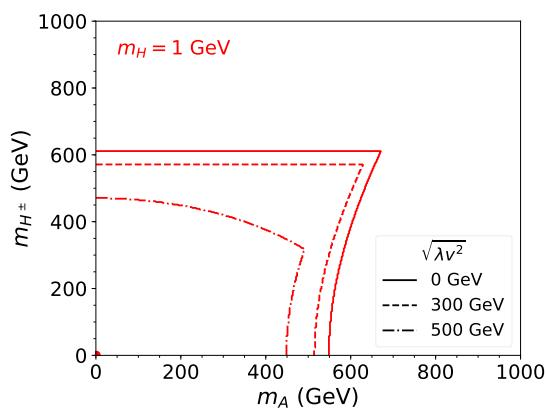

line

| m_A (GeV) | m_H± (GeV) for √λv² = 0 GeV | m_H± (GeV) for √λv² = 300 GeV | m_H± (GeV) for √λv² = 500 GeV |
| --------- | ---------------------------- | ------------------------------ | ------------------------------ |
| 0         | 600                          | 580                            | 480                            |
| 200       | 600                          | 580                            | 480                            |
| 400       | 600                          | 580                            | 480                            |
| 600       | 600                          | 580                            | 480                            |
| 800       | 600                          | 580                            | 480                            |
| 1000      | 600                          | 580                            | 480                            |

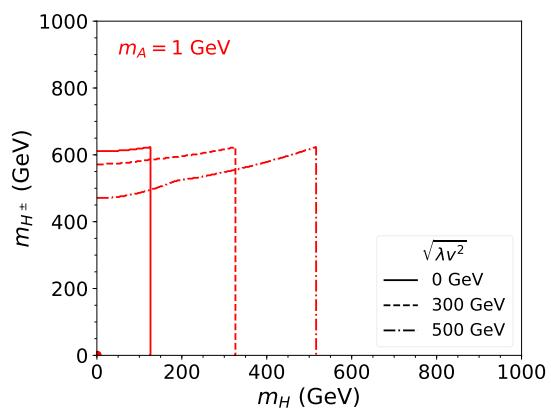

line

| m_H (GeV) | m_H± (GeV) for √λv² = 0 GeV | m_H± (GeV) for √λv² = 300 GeV | m_H± (GeV) for √λv² = 500 GeV |
| --------- | ---------------------------- | ------------------------------ | ------------------------------ |
| 0         | 600                          | 580                            | 480                            |
| 200       | 600                          | 590                            | 520                            |
| 400       | 600                          | 600                            | 560                            |
| 600       | 600                          | 610                            | 620                            |

Figure 2. Allowed region below and to the left of the curves by theoretical constraints for $m _ { H } = 1$ GeV (left panel) and $m _ { A } = 1 \mathrm { G e V }$ (right panel) for various values of $\lambda { v } ^ { 2 }$ . Here we have cos $( \beta - \alpha ) = 0$ .

Vacuum stability sets a lower bound on $\begin{array} { r } { \lambda v ^ { 2 } \equiv m _ { H } ^ { 2 } - \frac { m _ { 1 2 } ^ { 2 } } { \sin \beta \cos \beta } \gtrsim 0 } \end{array}$ H − sin β cos β & 0 as well as the lower m212 H±/A  H set the upper bounds on variables such as the mass splitting of limit on the mass splitting $m _ { H ^ { \pm } / A } ^ { 2 } - m _ { H } ^ { 2 } \ [ 1 5 1 ]$ . The unitarity and perturbativity together $m _ { H ^ { \pm } / A } ^ { 2 } - m _ { H } ^ { 2 } , \lambda v ^ { 2 }$ and tan $\beta$

$$
\lambda v ^ {2} <   4 \pi v ^ {2},
$$

$$
\max \{\tan \beta , \cot \beta \} \lesssim \sqrt {(8 \pi v ^ {2}) / (3 \lambda v ^ {2})}, \tag {4.5}
$$

$$
m _ {H ^ {\pm} / A} ^ {2} - m _ {H} ^ {2} \lesssim \mathcal {O} \left(4 \pi v ^ {2} - \lambda v ^ {2}\right).
$$

The allowed range for tan $\beta$ is strictly bounded for large $\lambda \boldsymbol { v } ^ { 2 }$ and unbounded when $\lambda v ^ { 2 } = 0$ . Given that the couplings of $H / A$ to fermions are proportional to $1 / \tan \beta , \ \lambda v ^ { 2 } \sim 0$ is preferred for a weakly coupled light Higgs to have a suppressed couplings to fermions. In addition, the lower and upper bounds for $m _ { H ^ { \pm } / A } - m _ { H } ^ { 2 }$ are determined solely by $\lambda \boldsymbol { v } ^ { 2 }$ .

To explore the scenarios in which a light non-SM Higgs is allowed, in figure 2, we plot the allowed region (below and to the left of the curves) in the plane of $m _ { H ^ { \pm } }$ and $m _ { A / H }$ for $m _ { H } = 1 \mathrm { G e V }$ (left panel) and $m _ { A } = 1 \mathrm { G e V }$ (right panel) under the alignment limit of cos ${ \mathfrak { s } } ( \beta - \alpha ) = 0$ . In order for H to be light, i.e. $m _ { H } \sim 1 \mathrm { G e V }$ , the heavy Higgs mass $m _ { H ^ { \pm } / A }$ can not be higher than around 600 GeV, and the maximally allowed charged Higgs mass is achieved when $\lambda v ^ { 2 } = 0$ . Note that the allowed regions are not very sensitive to mH for small $m _ { H }$ , so the conclusion holds for any mH around zero. In the right panel for $m _ { A } = 1 \mathrm { G e V }$ , $m _ { H }$ is restricted to be less than 125 GeV at $\lambda v ^ { 2 } = 0$ while $m _ { H ^ { \pm } }$ is allowed to reach around 600 GeV. Thus we conclude that, by the considerations of the theoretical constraints, the weakly coupled light neutral scalar is only allowed in two scenarios with $\lambda v ^ { 2 } \approx 0$ :

$$
m _ {H} \sim 0: m _ {A / H ^ {\pm}} \lesssim 6 0 0 \mathrm{GeV} \tag {4.6}
$$

$$
m _ {A} \sim 0: m _ {H ^ {\pm}} \lesssim 6 0 0 \mathrm{GeV}, m _ {H} \lesssim m _ {h}. \tag {4.7}
$$

The conclusion holds for small $| \cos ( \beta - \alpha ) | \sim 0$ as well.

# 4.2.2 Electroweak precision constraints

The current precisions on the oblique parameters S, T , U as well as the correlations among them are [154]

$$
S = 0. 0 4 \pm 0. 1 1, \quad T = 0. 0 9 \pm 0. 1 4, \quad U = - 0. 0 2 \pm 0. 1 1, \tag {4.8}
$$

$$
\rho_ {S T} = 0. 9 2, \quad \rho_ {S U} = - 0. 6 8, \quad \rho_ {T U} = - 0. 8 7.
$$

The electroweak precision measurements impose strong constraints on the mass splittings between the neutral and charged scalars of the Higgs doublet: $m _ { H ^ { \pm } }$ need to be around the mass of either mH or mA [131, 155, 156]. In particular, for small mH , only $m _ { A } \sim m _ { H ^ { \ast } }$ ± is allowed.

Combining with theoretical constraints and the direct searches at LEP [157], the legitimate scenarios for weakly coupled light scalars $\mathrm { a r e ^ { 3 } }$

$$
m _ {H} \sim 0: m _ {A} \sim m _ {H ^ {\pm}} \lesssim 6 0 0 \mathrm{GeV}, \tag {4.9}
$$

$$
m _ {A} \sim 0: m _ {H ^ {\pm}} \sim m _ {H} \lesssim m _ {h}, \tag {4.10}
$$

with $\lambda v ^ { 2 } \approx 0$ and $| \cos ( \beta - \alpha ) | \sim 0 .$ .

# 4.2.3 Flavor constraints

The flavor observations, such as $B \to X _ { s } \gamma , \ : B _ { s , d } \to \mu ^ { + } \mu ^ { - } , \ : B \to \bar { B }$ mixing, decays of B and D baryons, impose strong constraints on the charged Higgs mass as well as the value of tan $\beta$ . The limits on charged Higgs mass for four types of 2HDMs have been thoroughly studied in ref. [154]. Unlike the Type-II and Type-F 2HDMs with a charged Higgs mass $m _ { H ^ { \pm } } ~ < ~ 8 0 0 \mathrm { G e V }$ excluded by the measurement of the branching fraction of $B  X _ { s } \gamma \ [ 1 5 8 , \ 1 5 9 ]$ , in the Type-I 2HDM, only the low tan $\beta$ region receives flavor constraints. The strongest bound comes from $B _ { d } \to \mu ^ { + } \mu ^ { - }$ , which excludes regions of tan $\beta < 3$ for charged Higgs mass of 100 GeV. The constraints get weaker for larger $m _ { H } \pm \rangle$ tan $\beta < 1 . 2$ for $m _ { H ^ { \pm } } = 8 0 0 \mathrm { G e V }$ . Given the lack of tree-level flavor changing neutral current in the Type-I 2HDM for the neutral scalar sector, there is no lepton flavor violating FASER signals for the light scalar.

# 4.2.4 Invisible Higgs decays

For a light $H / A$ with long lifetime, $h  H H / A A$ is constrained from the invisible Higgs decay of $\mathrm { B r } ( h $ invisible) < 0.24 [160–163]. The Branch fraction of Higgs invisible decay is given by [113]

$$
\begin{array}{l} \operatorname{Br} (h \to H H / A A) = \frac {\Gamma (h \to H H / A A)}{\Gamma_ {h}} \\ \approx \frac {1}{\Gamma_ {h} ^ {\mathrm{SM}}} \frac {g _ {h H H / h A A} ^ {2}}{8 \pi m _ {h} ^ {2}} \left(1 - \frac {4 m _ {H / A} ^ {2}}{m _ {h} ^ {2}}\right) ^ {1 / 2} \simeq 4 7 0 0 \cdot \left(\frac {g _ {h H H / h A A}}{v}\right) ^ {2}. \tag {4.11} \\ \end{array}
$$

The full expressions for hHH and hAA couplings can be found at eqs. (C.1) and (C.2). To achieve suppressed ghHH or $g _ { h A A }$ to satisfy the invisible Higgs decay constraints, we have

$\mathrm { L i g h t } \ H : \quad \cos ( \beta - \alpha ) = \tan 2 \beta \frac { 2 \lambda v ^ { 2 } + m _ { h } ^ { 2 } } { 2 ( m _ { H } ^ { 2 } - 3 \lambda v ^ { 2 } - m _ { h } ^ { 2 } ) } \approx \frac { 1 } { \tan \beta } ,$ (4.12)

$\mathrm { L i g h t } \ A : \quad \cos ( \beta - \alpha ) = \tan 2 \beta { \frac { 2 \lambda v ^ { 2 } + m _ { h } ^ { 2 } + 2 m _ { A } ^ { 2 } - 2 m _ { H } ^ { 2 } } { 2 ( m _ { H } ^ { 2 } - \lambda v ^ { 2 } - m _ { h } ^ { 2 } ) } } \approx { \frac { 1 } { \tan \beta } } { \frac { 2 m _ { H } ^ { 2 } - m _ { h } ^ { 2 } } { m _ { H } ^ { 2 } - m _ { h } ^ { 2 } } } ,$ H − m2h , (4.13)

at the leading order of $\cos ( \beta - \alpha )$ , under the approximation of large tan $\beta _ { i }$ , small $\lambda \boldsymbol { v } ^ { 2 }$ , and light mH or $m _ { A }$ .

r the light H under this limit, . The experimental bounds on $\begin{array} { r } { g _ { h H H } \approx - \frac { m _ { h } ^ { 2 } } { 4 v } c _ { \beta - \alpha } ^ { 2 } } \end{array}$ , which leads to y branching rati $\mathrm { B r } ( h  H H ) \simeq$ $7 5 c _ { \beta - \alpha } ^ { 4 } .$ satisfied for $c _ { \beta - \alpha } < 0 . 2 5$ and tan $\beta > 4$ . At the same time, the couplings of H to gauge bosons and fermions are suppressed as well for the large tan $\beta$ region of the Type-I 2HDM:

$$
\xi_ {A} ^ {f} = 1 / \tan \beta , \tag {4.14}
$$

$$
\xi_ {H} ^ {V} = c _ {\beta - \alpha} \approx 1 / \tan \beta , \tag {4.15}
$$

$$
\xi_ {H} ^ {f} = c _ {\beta - \alpha} (1 - s _ {\beta - \alpha}) \approx 1 / (2 \tan^ {3} \beta). \tag {4.16}
$$

Therefore, diphoton channel becomes dominated when tan $\beta$ gets large at the Type-I 2HDM.

For the light pseudoscalar scenario, we could adopt the same way as the light H case discussed above to meet Higgs invisible decay constraint. However, ghAA can also stay small under alignment limit when A is light, and $m _ { H } \sim m _ { h } / \sqrt { 2 } \sim 9 0 \mathrm { G e V }$ . Combining with other constraints that lead to eq. (4.9) and eq. (4.10), we consider two benchmark scenarios in the Type-I 2HDM,

$\mathrm { L i g h t } \ H : \quad \cos ( \beta - \alpha ) = { \frac { 1 } { \tan \beta } } , \ m _ { A } = m _ { H ^ { \pm } } = 6 0 0 \mathrm { G e V } , \ \lambda v ^ { 2 } = 0 ,$ n β (4.17)

$\mathrm { L i g h t } ~ { \cal A } : ~ \cos ( \beta - \alpha ) = 0 , ~ m _ { H } = m _ { H ^ { \pm } } = 9 0 \mathrm { G e V } , ~ \lambda v ^ { 2 } = 0 ,$ (4.18)

with large tan $\beta$ to accommodate a long-lived particle. Note that in the light A case, a relatively light-charged Higgs of 90 GeV is chosen. Such a scenario with GeV-scale pseudoscalar survives the LEP charged Higgs search [157]: $m _ { H ^ { \pm } } \gtrsim 8 5 \mathrm { G e V }$ is still viable for light $m _ { A }$ . The LHC charged Higgs search [164–169] only excluded tan $\beta < 5$ for $m _ { H ^ { \pm } }$ in the mass range of (100,160) GeV. The LHC searches limits on the heavy charged Higgs $\left( m _ { H ^ { \pm } } > m _ { t } \right)$ with $H ^ { \pm }  \tau \nu \ [ 1 6 5$ , 166] does not constrain the Type-I 2HDM since the production cross section is heavily suppressed at the large tan $\beta$ region.

# 4.2.5 Other experimental constraints

There are a variety of constraints on light scalars from beam dump experiments, supernovae, and meson decays. Here we have a brief list summarizing the most relevant ones.

CHARM bounds. The CHARM Collaboration has searched for light axion-like particles at CERN with a 400 GeV proton beam-dump experiment on a copper target [170]. Its results can be used to constrain the light scalar [128, 171].

SuperNova. A light, weakly coupled scalar can affect astrophysical processes. During supernova (SN) explosion, the scalar emission can contribute significantly to the energy loss, shortening the neutrino pulse duration [172]. Observation of core energy loss from the emission of light scalars produced through nucleon bremsstrahlung process $N N  N N S ( A )$ , would place constraints on the light scalars [173–177].

B meson decays. For (pseudo)scalar mass below the B threshold, searches for B decays with leptonic final states become relevant. The leading constraints come from LHCb measurements of $B \to K ^ { * } \phi$ with $\phi  \mu \mu \ [ 1 7 8 ]$ and $B ^ { + } \to K ^ { + } \chi ( \mu ^ { + } \mu ^ { - } )$ [179]. Searches on B decay into neutrinos BR $( B \to X _ { s } \nu \bar { \nu } ) = 6 . 4 \times 1 0 ^ { - 4 }$ [180] impose an upper limit on branching fractions of the (pseudo)scalar production from B decay, in particular, on double (pseudo)scalar productions with long lived (pseudo)scalars escape the detector.

Kaon decays. Kaon decays also contribute to the searches for light scalar region. The latest relevant ones are $K ^ { + }  \pi ^ { + } X$ with X to νν¯ at NA62 [181] with BR $( K \to \pi \nu \bar { \nu } ) =$ $( 1 0 . 6 _ { - 3 . 4 } ^ { + 4 . 0 } | \mathrm { s t a t } \pm 0 . 9 \mathrm { s y s t } ) \times 1 0 ^ { - 1 1 }$ (68% C.L.), $K ^ { + }  \pi ^ { + } \chi ( e ^ { + } e ^ { - } )$ at MicroBooNE [182] (95% C.L.), and $\operatorname { B r } \left( K ^ { + } \to \pi ^ { + } X \right)$ at E949 $[ 1 8 3 ] ~ ( 9 0 \% ~ \mathrm { C . L . } )$ . All of them provide constraints based on the light scalar decay lifetime hypotheses.

D meson decays. The current limits can be found in PDG [184], as well as the recent LHCb results [185]. Those are typically not included in light scalar constraints since in most models, $\mathrm { B r } ( D ^ { + } \to \pi ^ { + } \phi )$ (corresponding to $\mathrm { B r } ( c  u \phi ) )$ is rather small.

LEP. OPAL, ALEPH and L3 searches on $e ^ { + } e ^ { - } \to Z ^ { * } \phi$ at the LEP detected $3 \times 1 0 ^ { 6 }$ hadronic Z decays [186–188], which included both the prompt and invisible/long-lifetime $\phi$ cases. When $m _ { \phi } \leq 2 m _ { \mu } , \phi$ with high momentum can escape the LEP detector to be an invisibly decaying scalar. For $m _ { \phi } > 2 m _ { \mu } , \phi$ could decay promptly. Thus the LEP search results could constrain the light scalar scenario [128, 189].

To impose the experimental constraints mentioned above, we recast the existing bounds to the Type-I 2HDM parameter space for B, kaon, D meson decays as well as the LEP search results. For the CHARM bounds and SuperNova constraints, we use the approximate results from the SM with an additional light scalar scenario [128, 190] since the detailed recast of these two bounds involves a complete analyses of all possible contributions in the framework of the Type-I 2HDMs, which is left for future study.

# 4.3 FASER and FASER2

FASER is a cylindrical detector with a radius of 10 cm and a length of 1.5 m, installed in tunnel TI12 located at 480 m away from the ATLAS IP [101–106]. It is designed to detect LLPs produced at the ATLAS IP, traveling in the very forward region, and decaying in FASER into two very energetic particles. Unlike all the other proposed LLP experiments, FASER is able to detect photons with a preshower detector placed in front of the FASER calorimeter [49, 109]. The signals consist of highly energetic charged particles or photons that emerge from the decay volume. The charged particle signal would leave multiple high-momentum tracks in the spectrometer, which are consistent with a single vertex in the decay volume, point back to the IP and might leave a large energy deposit in the calorimeter. The multi-photon signal would leave a characteristic signal in the preshower and deposit a large amount of energy in the calorimeter. In both cases, the signal leaves no activity in the front veto.

The potential backgrounds are particles (mainly muons) coming from the IP and beam, which can be detected by the veto station. The FASER collaboration recently presented their first analysis on a dark photon signal [191]. They considered a variety of possible background sources associated with veto inefficiencies, neutral hadrons, muons missing the veto, neutrinos and non-collision background. These backgrounds were found to be either very small or negligible. No events with reconstructed tracks passing the veto requirement have been seen. We therefore assume that backgrounds for multi-track signatures are negligible. So far, no analyses with multi-photon signatures have been performed by the FASER collaboration. The dominating background will likely come from neutrino interactions in the beginning of the calorimeter, which also leave the front veto unaffected and can lead to large deposited energy. To address this issue, a simple preshower was installed in the front of the calorimeter, which will significantly reduce these backgrounds [104]. A high-precision preshower upgrade will be installed at the end of 2023, which will allow the experiment to identify multi-photon signatures and hence reduce possible backgrounds [192]. We therefore assume that backgrounds for multi-photon signatures are negligible.

FASER has been taking data since summer, 2022. During the Run 3 of the LHC, it is expected to collect data from proton-proton collisions of about 150 $\mathrm { { f b } ^ { - 1 } }$ integrated luminosity. Given the distinctive signature and low background environment, FASER provides a unique opportunity to probe light particles with suppressed couplings [101, 103, 107]. The design for FASER2 is currently under development [112]. It will follow a similar architecture as the currently operating FASER detector. While the design has not yet been finalized, it is envisioned to be background free.

At the HL-LHC with an integrated luminosity of 3 fb−1, FASER will be upgraded to FASER 2 with a larger volume of the detector, potentially at the same location [107] or at FPF [111, 112] about 620 meters from the LHC $\mathrm { I P ^ { 4 } }$ FASER 2 will extend the reach of FASER by an order of magnitude or more.

In our analyses below, we adopt the configuration of FASER 2 in the original proposal [107], sitting 480 m away from the LHC IP:

$$
\text {FASER}: \quad \Delta = 1. 5 \mathrm{m}, \quad R = 1 0 \mathrm{cm}, \quad \mathcal {L} = 1 5 0 \mathrm{fb} ^ {- 1}, \tag {4.19}
$$

$$
\text {FASER} 2: \quad \Delta = 5 \mathrm{m}, \quad R = 1 \mathrm{m}, \quad \mathcal {L} = 3 \mathrm{ab} ^ {- 1}. \tag {4.20}
$$

Here $\Delta$ and R are the detector length and radius respectively.

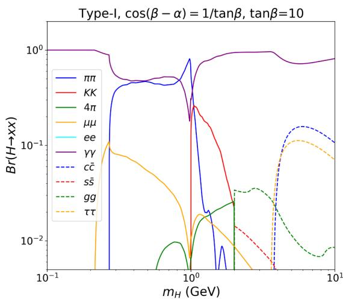

line

| m_H (GeV) | ππ     | KK     | 4π     | μμ     | ee     | γγ     | c̃c     | ss̃     | gg     | ττ     |
| --------- | ------ | ------ | ------ | ------ | ------ | ------ | ------ | ------ | ------ | ------ |
| 0.1       | ~0.1   | ~0.1   | ~0.1   | ~0.1   | ~0.1   | ~1.0   | ~0.1   | ~0.1   | ~0.1   | ~0.1   |
| 1.0       | ~1.0   | ~0.1   | ~0.01  | ~0.01  | ~0.01  | ~1.0   | ~0.1   | ~0.1   | ~0.1   | ~0.1   |
| 10.0      | ~0.1   | ~0.1   | ~0.01  | ~0.01  | ~0.01  | ~1.0   | ~0.1   | ~0.1   | ~0.1   | ~0.1   |

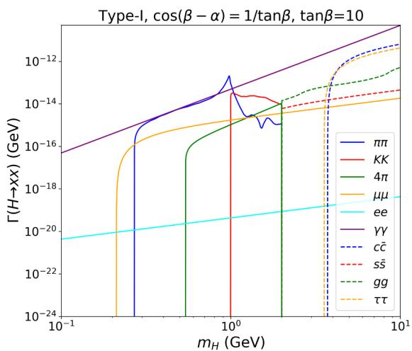

line

| m_H (GeV) | ππ        | KK        | 4π        | μμ        | ee        | γγ        | cc̃        | ss̃        | gg        | ττ        |
|-----------|-----------|-----------|-----------|-----------|-----------|-----------|----------|----------|-----------|-----------|
| 0.1       | ~10^-24   | ~10^-24   | ~10^-24   | ~10^-24   | ~10^-20   | ~10^-16   | ~10^-20  | ~10^-20  | ~10^-20   | ~10^-20   |
| 1.0       | ~10^-12   | ~10^-14   | ~10^-14   | ~10^-14   | ~10^-20   | ~10^-14   | ~10^-18  | ~10^-18  | ~10^-18   | ~10^-20   |
| 10.0      | ~10^-12   | ~10^-14   | ~10^-14   | ~10^-14   | ~10^-20   | ~10^-12   | ~10^-14  | ~10^-14  | ~10^-14   | ~10^-20   |

Figure 3. The decay branching fractions (left) and partial widths (right) of light CP even Higgs in the Type-I 2HDM for the light H benchmark point. Decays to hadrons and quarks/gluons are connected at $m _ { H } = 2 \mathrm { G e V }$ .

# 4.4 Results for the light CP-even Higgs in the Type-I 2HDM

The productions of a light CP-even Higgs H are mostly via the semileptonic decay of pions and kaons, or the hadronic decay of kaons, η, B and D mesons, as well as radiative decay of bottomonium Υ as discussed in section 2.2. In our numerical analyses below, we only take into account the φ productions from B, kaon, and pion meson decays since the contribution from D meson is eleven orders of magnitude smaller due to the suppression from the CKM matrix elements as well as $m _ { b }$ versus $m _ { t }$ suppression for the mass of the quark running in the loop [122].

In the 2HDM, the effective flavor changing coupling $\xi _ { \phi } ^ { i j }$ as defined in eq. (2.4) is given by [193–196]

$$
\begin{array}{l} \xi_ {\phi} ^ {i j} | _ {\mathrm{2HDM}, h / H} = - \frac {4 G _ {F} \sqrt {2}}{1 6 \pi^ {2}} \sum_ {k} V _ {k i} ^ {*} m _ {k} ^ {2} \left[ g _ {1} (x _ {k}, x _ {H ^ {\pm}}) \binom{\sin (\beta - \alpha)}{\cos (\beta - \alpha)} \right. \\ \left. + g _ {2} \left(x _ {k}, x _ {H ^ {\pm}}\right) \binom {\cos (\beta - \alpha)} {- \sin (\beta - \alpha)} - g _ {0} \left(x _ {k}, x _ {H ^ {\pm}}\right) \frac {2 v}{m _ {W} ^ {2}} \binom {\lambda_ {h H ^ {+} H ^ {-}}} {\lambda_ {H H ^ {+} H ^ {-}}} \right] V _ {k j}, \tag {4.21} \\ \end{array}
$$

where the upper functions are for h and lower ones are for H, and the trilinear couplings $\lambda _ { ( h , H ) H ^ { + } H ^ { - } }$ are defined in appendix C, and the auxiliary functions $^ { g _ { 0 , 1 , 2 } }$ in the Type-I 2HDM are given in appendix D with $x _ { k } \equiv m _ { x } ^ { 2 } / m _ { W } ^ { 2 }$ and $x _ { H } ^ { \pm } \equiv m _ { H ^ { \pm } } ^ { 2 } / m _ { W } ^ { 2 }$ where $m _ { x }$ is the mass of the quark running in the loop.

There are also 2HDM charged Higgs contributions to the effective four-fermion-Higgs interaction similar to figure 1 and eq. (2.6). In our calculation, we ignore such contributions since usually the couplings between charged scalar and first two generations of fermions are suppressed by the small values of the first two generation fermion masses.

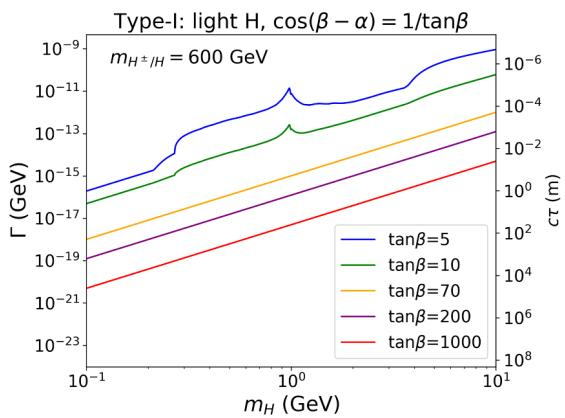

line

| m_H (GeV) | Γ (GeV) for tanβ=5 | Γ (GeV) for tanβ=10 | Γ (GeV) for tanβ=70 | Γ (GeV) for tanβ=200 | Γ (GeV) for tanβ=1000 | cτ (m) for tanβ=5 | cτ (m) for tanβ=10 | cτ (m) for tanβ=70 | cτ (m) for tanβ=200 | cτ (m) for tanβ=1000 |
| --------- | ------------------ | ------------------- | ------------------- | -------------------- | --------------------- | ----------------- | ------------------ | ------------------ | ------------------- | -------------------- |
| 0.1       | ~1e-15             | ~1e-16              | ~1e-17              | ~1e-18               | ~1e-21                | ~1e-6             | ~1e-4              | ~1e-3              | ~1e-2               | ~1e-1                |
| 1.0       | ~1e-13             | ~1e-14              | ~1e-15              | ~1e-16               | ~1e-22                | ~1e-5             | ~1e-3              | ~1e-2              | ~1e-1               | ~1e-0                |
| 10.0      | ~1e-9              | ~1e-8               | ~1e-7               | ~1e-7                | ~1e-23                | ~1e-4             | ~1e-2              | ~1e-1              | ~1e0                | ~1e+0                |

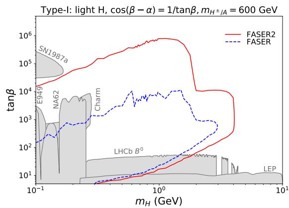

line

| m_H (GeV) | FASER2 (tanβ) | FASER (tanβ) |
| --------- | ------------- | ------------ |
| 0.1       | ~10^3         | ~10^2        |
| 1.0       | ~10^5         | ~10^3        |
| 10.0      | ~10^4         | ~10^2        |

Figure 4. Left Panel: the total decay width (left y-axis) and decay length cτ (right y-axis) of the light CP-even Higgs in the Type-I 2HDM for the light H benchmark point. Right Panel: FASER (blue dashed curve) and FASER 2 reach (red solid curve) for the light CP even Higgs H in the $m _ { H }$ vs. tan $\mathbf { \nabla } . \beta$ plane. Various current experimental constraints are shown in grey regions.

Figure 3 shows the decay branching fractions (left panel) and partial decay widths (right panel) of the light H in Type-I 2HDM under the relation of cos $( \beta - \alpha ) = 1 /$ tan $\beta$ for tan $\beta = 1 0$ . Here the dominant decay mode is diphoton, which receives tan $\beta$ independent contributions from charged Higgs loop in addition. All other channels into the quark, lepton, and gluon final states are suppressed since $\xi _ { H } ^ { f } \propto 1 / \tan ^ { 3 } \beta$ . H → ππ is dominated around 1 GeV due to the corresponding decay form factors [128]. As discussed in section 2.3, decays to mesons and quarks/gluons are connected smoothly at $m _ { H } = 2 \mathrm { G e V }$ .

The left panel of figure 4 shows the decay width and decay length $c \tau$ of the light H in the $\mathrm { T y p e { - } I }$ 2HDM for the light H benchmark point. The Γ and $c \tau$ become straight line for very large tan $\beta$ as a consequence of dominated diphoton decay. $c \tau$ reaches a few centimeters to meters for tan $\beta > 1 0$ .

To obtain the FASER and FASER 2 reaches, we consider the LLPs produced from the various meson decays with FORESEE [114]. The light meson spectra are generated by EPOS-LHC [197] as implemented in the package CRMC [198], while the B meson spectrum is generated by Pythia 8 [199]. We assume 100% acceptance rate for all final states with the FASER and FASER 2 configurations and integrated luminosities specified in eqs. (4.19) and (4.20).

In the right panel of figure 4, we show the potential three event reach by FASER (blue dashed curve) and FASER2 (red solid curve) in the plane of $m _ { H }$ vs. tan $\beta$ for the light H benchmark point. Also shown in gray regions are the other experimental constraints, including B meson decays at LHCb [178], $K ^ { + }$ decays from NA62 [181], and E949 [183] (at 90% C.L.), CHARM beam dump [170, 174], light scalar search $e ^ { + } e ^ { - } \to Z ^ { * } \phi$ at LEP(L3) [128, 186], and light scalar constraints from supernova explosion at SN1987a [172– 174]. The dip in the NA62 bounds around $m _ { \pi }$ is due to the cross over of two experimental search regions. MicroBooNE [182] bounds, SM Higgs coupling measurements [200], Higgs invisible decay, as well as flavor bounds [154] do not constrain the CP-even scalar case in the chosen parameter region of tan $\beta > 5$ .

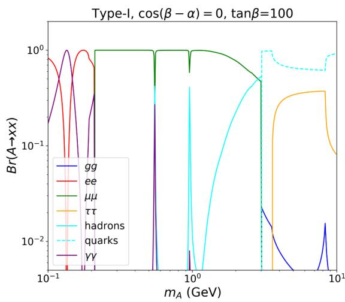

line

| m_A (GeV) | gg     | ee     | μμ     | ττ     | hadrons | quarks | γγ     |
|-----------|--------|--------|--------|--------|---------|--------|--------|
| 0.1       | 1.0    | 1.0    | 1.0    | 1.0    | 1.0     | 1.0    | 1.0    |
| 0.5       | 0.01   | 0.01   | 1.0    | 1.0    | 1.0     | 1.0    | 1.0    |
| 1.0       | 0.01   | 0.01   | 1.0    | 1.0    | 1.0     | 1.0    | 1.0    |
| 2.0       | 0.01   | 0.01   | 0.5    | 0.5    | 0.5     | 1.0    | 1.0    |
| 5.0       | 0.01   | 0.01   | 0.1    | 0.1    | 0.1     | 1.0    | 1.0    |
| 10.0      | 0.01   | 0.01   | 0.05   | 0.05   | 0.05    | 1.0    | 1.0    |

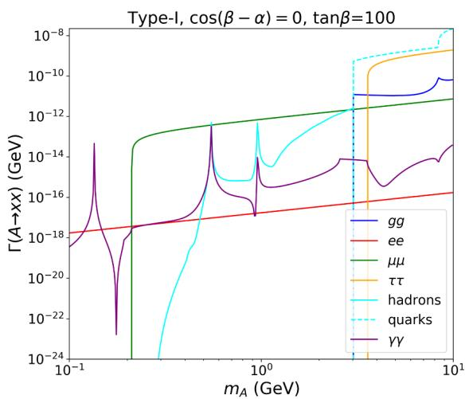

line

| m_A (GeV) | gg       | ee       | μμ       | ττ       | hadrons  | quarks   | γγ       |
|-----------|----------|----------|----------|----------|----------|----------|----------|
| 0.1       | ~10^-18  | ~10^-18  | ~10^-24  | ~10^-24  | ~10^-24  | ~10^-24  | ~10^-24  |
| 1.0       | ~10^-16  | ~10^-16  | ~10^-12  | ~10^-12  | ~10^-12  | ~10^-12  | ~10^-16  |
| 10.0      | ~10^-14  | ~10^-14  | ~10^-10  | ~10^-10  | ~10^-8   | ~10^-8   | ~10^-14  |

Figure 5. The decay branching fractions (left panel) and partial decay widths of the light CP-odd Higgs A in the $\mathrm { T y p e { - } I }$ 2HDM for the light A benchmark point with tan $\beta = 1 0 0$ . Decays to hadrons and quarks/gluons are connected at $m _ { A } = 3 \mathrm { G e V }$ .

While the sub-GeV region is already well explored by other current experiments, as well as the low tan $\beta$ region by LHCb and LEP, FASER and FASER 2 offers unique opportunities to cover the large tan $\beta$ region up to tan $\beta = 1 0 ^ { 4 }$ and $1 0 ^ { 6 }$ respectively, and $m _ { H }$ reach up to $m _ { B }$ due to the $B  H X _ { s }$ production. The reduction of the reach in tan $\beta$ for $m _ { H } > m _ { B } / 2$ is due to the reduction of H production beyond the HH production threshold. FASER 2 increases the FASER reach in tan $\beta$ by about two orders of magnitude at large tan $\beta$ region. Such a difference mainly comes from the 20 times larger luminosity and 300 times larger detector, which also pushes the reach at the large $m _ { H }$ region to $m _ { H } \approx m _ { B }$ .

# 4.5 Results for the light CP-odd Higgs in the Type-I 2HDM

Given the mixture of the light CP-odd scalar with pseudo-Goldstone bosons $\pi ^ { 0 }$ , η and $\eta ^ { \prime }$ as shown in eq. (3.5), A can be produced in any process that produces those mesons. In addition, A can be produced in the weak decays of SM mesons, in particular, $K  \pi A$ and $B  X _ { s } A$ , as well as the less important radiative decays of bottomonium Υ and charmonium $J / \psi$ . For the detailed formulae about the production, see section 3.2. In our numerical analyses, we take into account all of these productions except for the radiative decays.

Similar to the CP-even Type-I 2HDM case, the effective flavor changing coupling $\xi _ { A } ^ { i j }$ from eq. (3.6) is given by [138–140, 193–196]

$$
\xi_ {A} ^ {i j} | _ {\mathrm{2HDM}} = \frac {4 \sqrt {2} G _ {F}}{1 6 \pi^ {2}} \sum_ {k} V _ {k i} ^ {*} m _ {k} ^ {2} \left[ Y _ {1} \left(x _ {k}, x _ {H ^ {\pm}}\right) \cot \beta + Y _ {2} \left(x _ {k}, x _ {H ^ {\pm}}\right) \cot^ {3} \beta \right] V _ {k j}, \tag {4.22}
$$

for ij being down-type quarks. The auxiliary functions $Y _ { 1 , 2 } \left( x _ { k } , x _ { H ^ { \pm } } \right)$ are given in appendix D.

Figure 5 shows the decay branching fractions (left panel) and partial decay widths of the light CP-odd A in the $\mathrm { T y p e { - } I }$ 2HDM for the light A benchmark point with tan $\beta = 1 0 0$ .

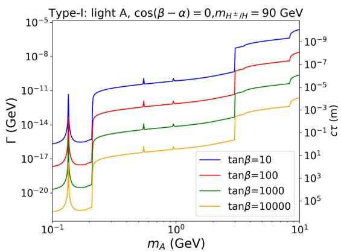

line

| m_A (GeV) | Γ (GeV) for tanβ=10 | Γ (GeV) for tanβ=100 | Γ (GeV) for tanβ=1000 | Γ (GeV) for tanβ=10000 | ct (m) for tanβ=10 | ct (m) for tanβ=100 | ct (m) for tanβ=1000 | ct (m) for tanβ=10000 |
| --------- | ------------------ | ------------------- | -------------------- | --------------------- | ----------------- | ------------------ | ------------------- | -------------------- |
| 0.1       | ~1e-17             | ~1e-17              | ~1e-20               | ~1e-20                | ~1e-9             | ~1e-9              | ~1e-9               | ~1e-9                |
| 1.0       | ~1e-14             | ~1e-14              | ~1e-17               | ~1e-17                | ~1e-8             | ~1e-8              | ~1e-8               | ~1e-8                |
| 10.0      | ~1e-8              | ~1e-8               | ~1e-5                | ~1e-5                | ~1e-7             | ~1e-7              | ~1e-7               | ~1e-7                |

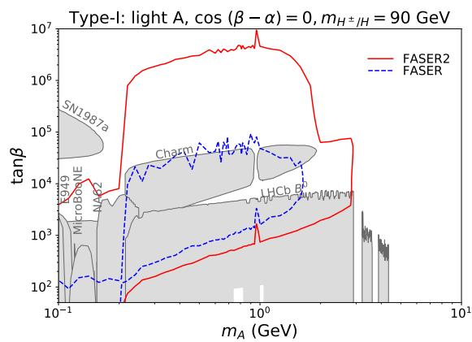

line

| Experiment | tanβ (log scale) |
| ---------- | ---------------- |
| SN1987a    | ~10^5            |
| E949       | ~10^3            |
| MicroBONE  | ~10^3            |
| NAD2       | ~10^3            |
| Charm      | ~10^4            |
| HHCB       | ~10^3            |
| LHCb       | ~10^3            |
| Other      | ~10^3–10^4       |

Figure 6. Left Panel: the total decay width (left y-axis) and decay length $c \tau$ (right y-axis) of the light CP-odd Higgs in the Type-I 2HDM for the light A benchmark point. Right Panel: the FASER (blue dashed curve) and FASER 2 reach (red solid curve) for the light CP-odd Higgs A in the parameter space of $m _ { A }$ vs. tan $\beta$ plane. Various current experimental constraints are shown in grey regions.

For $m _ { A } < 2 \mathrm { m } _ { \mu }$ , both ee and $\gamma \gamma$ channels are important. $\mu \mu$ channel is dominated before hadronic modes open. Once $m _ { A } > 3 \mathrm { G e V }$ , hadronic decay modes dominate.

The decay width and decay length $c \tau$ of the light pseudoscalar A in the Type-I 2HDM for various tan $\beta$ are presented in the left panel of figure 6. The peaks around $m _ { A } \sim 1$ 1 GeV or below are introduced by the $\pi ^ { 0 }$ , η and $\eta ^ { \prime }$ resonances. The sudden increase of hadronic decay width at $m _ { A } = 3$ GeV is mainly due to the opening of the $c \bar { c }$ decay mode. After that point, the cc¯ and gluon-gluon decays kick ${ \mathrm { i n } } ,$ which leads to the growth of total decay width.5 Note that unlike the CP-even case as shown in the left panel of figure $^ { 4 , }$ the tan $\beta$ dependence of decay width $\Gamma _ { A }$ is only of an overall shift with the same feature. This is because the couplings of A to the SM particle have identical $1 /$ tan $\beta$ dependence.

In the right panel of figure 6, we show the potential reach by FASER (blue dashed curve) and FASER 2 (red solid curve) in the plane of $m _ { A }$ vs. tan $\beta$ for the light A benchmark point. The other current experimental constraints are shown in gray regions,6 similar to figure 4. Note that the CHARM bounds extend to the larger region of $m _ { A } \sim 2 \mathrm { G e V }$ [190], comparing to the CP-even case of $m _ { H } \sim 3 0 0 \mathrm { M e V }$ [128]. The difference of the CHARM constraints between the CP-even and CP-odd case is consistent with ref. [107], which shows a factor of 20 enhancement in the production of the CP-odd scalar from B decay compared to the CP-even case. The LEP limits at the low tan $\beta$ are not present since the value of tan $\beta$ starts at 50. Compared to the light H case, regions with much larger tan $\beta$ can be probed. This is because the different tan $\beta$ dependence for $\xi _ { A } ^ { f }$ , comparing to that of $\xi _ { H } ^ { f }$ , as shown in eqs. (4.14) and (4.16). Similarly to light CP-even scalar case, the FASER 2 coverage of tan $\beta$ is about two orders of magnitude higher. The reduction of tan $\beta$ reach at $m _ { A } > m _ { B } / 2$ is due to the reduction of the A production beyond the AA pair production threshold. The $m _ { A }$ coverage in the light CP-odd scalar case is much more sensitive to the geometry of the detector, especially its radius.

# 5 Conclusion

In this paper, we studied the scenario with a light weakly coupled CP-even scalar H or a CP-odd scalar A with a relatively long lifetime. We considered a model-independent framework describing the most general interactions between a CP-even or CP-odd scalar and SM particles using the notation of coupling modifiers in the effective Lagrangian. We developed a general formalism for the productions of the light scalar from meson decays, as well as re-analysed the scalar decay rates. In particular, we performed state of the art calculation of the hadronic decays of light scalars across different mass range, using chiral perturbation theory, dispersive analysis, and spectator model. We also developed a general program [115] to calculate the decays of a light CP-even or CP-odd scalar, incorporating the coupling modifiers of the light scalars to the SM particles. Our program can be used to evaluate the decay of light scalars in many scenarios beyond the SM.

After developing the general formalism, we carried out a specific case study in the large tan $\beta$ region of the Type-I 2HDM, which could naturally accommodate a light scalar with suppressed couplings while satisfying all the theoretical and experimental constraints. We chose two benchmark scenarios: a light H with $\cos ( \beta - \alpha ) = 1 / \tan \beta$ and other non-SM scalar mass around 600 GeV, and a light A under alignment limit cos $( \beta - \alpha ) = 0$ and other non-SM scalar mass 90 GeV. The light scalar decay length varies in $( 1 0 ^ { - 8 } , 1 0 ^ { 5 } )$ meters. We further obtained the FASER and FASER 2 reaches for those benchmark scenarios, which probe the parameter space at the very large tan $\beta$ region. The comparison of the FASER and FASER 2 reach shows that both higher luminosity and larger detector help to reach the weaker coupling region. A larger detector, especially the radius helps to extend the reach in $m _ { A }$ . The current FASER 2 configuration can reach the mass production threshold around $m _ { B }$ .

Forward LHC experiments, like FASER and FASER 2, offer a unique opportunity to detect light long-lived sectors. They are complementary to the beyond the SM searches based on the prompt decay at the LHC main detectors, LLP searches in the transverse region, as well as fixed target searches at low energies. The discovery of a long-lived light scalar at FASER and FASER 2 provides an unambiguous evidence for new physics beyond the SM. The on-going LHC Run 3 and the upcoming HL-LHC have great potential in exploring both the energy and intensity frontiers of particle physics.

# Acknowledgments

FK acknowledges support by the Deutsche Forschungsgemeinschaft under Germany’s Excellence Strategy - EXC 2121 Quantum Universe - 390833306. HS is supported by the International Postdoctoral Exchange Fellowship Program. SS is supported by the

Department of Energy under Grant No. DE-FG02-13ER41976/DE-SC0009913. WS is supported by the Junior Foundation of Sun Yat-sen University and Shenzhen Science and Technology Program (Grant No. 202206193000001, 20220816094256002).

# A Form factors $A _ { \mathbf { 0 } , \mathbf { 1 } / \mathbf { 2 } , \mathbf { 1 } }$

The expressions for the form factors $A _ { 0 , 1 / 2 , 1 } ^ { \phi }$ for scalars, fermions, and gauge bosons in the loop contribution to $\xi _ { \phi } ^ { g }$ and $\xi _ { \phi } ^ { \gamma }$ of the CP-even scalar $\phi \mathrm { a r e } ^ { 7 }$

$$
A _ {0} ^ {\phi} (\tau) = - \frac {1}{2} [ \tau - f (\tau) ] \tau^ {- 2}, \tag {A.1}
$$

$$
A _ {1 / 2} ^ {\phi} (\tau) = [ \tau + (\tau - 1) f (\tau) ] \tau^ {- 2}, \tag {A.2}
$$

$$
A _ {1} ^ {\phi} (\tau) = - \frac {1}{2} \left[ 2 \tau^ {2} + 3 \tau + 3 (2 \tau - 1) f (\tau) \right] \tau^ {- 2}, \tag {A.3}
$$

with $\tau = m _ { \phi } ^ { 2 } / 4 m ^ { 2 }$ for m being the mass of the particle running in the loop, and

$$
f (\tau) = \left\{ \begin{array}{l l} \arcsin^ {2} \sqrt {\tau} & \text { if } \tau \leqslant 1 \\ - \frac {1}{4} \left(\log \frac {1 + \sqrt {1 - 1 / \tau}}{1 - \sqrt {1 - 1 / \tau}} - i \pi\right) ^ {2} & \text { if } \tau > 1 \end{array} . \right. \tag {A.4}
$$

For the CP-odd scalar A, the form factor $A _ { 1 / 2 } ^ { A }$ for fermion loop contribution to $\xi _ { A } ^ { g }$ and $\xi _ { A } ^ { \gamma }$ of the CP-odd scalar A is

$$
\mathcal {A} _ {1 / 2} ^ {A} = 2 \tau^ {- 1} f (\tau). \tag {A.5}
$$

# B Formulae related to tri-meson decay of CP-odd scalar

The decay width for a pseudoscalar A to tri-meson final state $\Pi _ { i } \Pi _ { j } \Pi _ { k }$ can be written as

$$
\begin{array}{l} \Gamma (A \to \Pi_ {i} \Pi_ {j} \Pi_ {k}) = \frac {1}{2 5 6 S _ {i j k} \pi^ {3} m _ {A}} \int_ {(m _ {j} + m _ {k}) ^ {2}} ^ {(m _ {A} - m _ {i}) ^ {2}} d s | \mathcal {M} _ {A} ^ {i j k} | ^ {2} \\ \sqrt {1 - \frac {2 (m _ {j} ^ {2} + m _ {k} ^ {2})}{s} + \frac {(m _ {j} ^ {2} - m _ {k} ^ {2}) ^ {2}}{s ^ {2}}} \times \sqrt {\left(1 + \frac {s - m _ {i} ^ {2}}{m _ {A} ^ {2}}\right) ^ {2} - \frac {4 s}{m _ {A} ^ {2}}}, \tag {B.1} \\ \end{array}
$$

where $m _ { A , i , j , k }$ are the masses for $A , \Pi _ { i } , \Pi _ { j } , \Pi _ { k }$ , respectively. $S _ { i j k }$ is a symmetry factor: 1, 2, 3! depending on the number of identical particles in the final state. $\mathcal { M } _ { A } ^ { i j k }$ stands for the transition amplitude for process $A  \Pi _ { i } \Pi _ { j } \Pi _ { k }$ , which receives contributions from $A _ { \mathrm { C P - o d d } } \to \Pi _ { i } \Pi _ { j } \Pi _ { k }$ , denoted as $\mathcal { A } _ { A } ^ { i j k }$ i j k, as well as from quartic-meson transition amplitude $\mathcal { A } ^ { i j k l }$ due to mixing.

$$
\mathcal {M} _ {A} ^ {i j k} \propto O _ {A A} \mathcal {A} _ {A} ^ {i j k} + \sum_ {l} O _ {A l} \mathcal {A} ^ {i j k l}. \tag {B.2}
$$

Expressions for $\mathcal { A } _ { A } ^ { i j k }$ can be read off from the chiral Lagrangian $[ 1 1 7 ] { : } ^ { 8 }$

$$
\mathcal {A} _ {A} ^ {\pi^ {0} \pi^ {0} \pi^ {0}} = 3 \mathcal {A} _ {A} ^ {\pi^ {0} \pi^ {+} \pi^ {-}} = - \frac {1}{2 v f _ {\pi}} \left(\frac {B m _ {u}}{f _ {\pi}} \xi_ {A} ^ {u} - \frac {B m _ {d}}{f _ {\pi}} \xi_ {A} ^ {d}\right), \tag {B.3}
$$

$$
\mathcal {A} _ {A} ^ {\eta \pi^ {0} \pi^ {0}} = \mathcal {A} _ {A} ^ {\eta \pi^ {+} \pi^ {-}} = - \frac {\sqrt {3}}{6 v f _ {\pi}} \left(\frac {B m _ {u}}{f _ {\pi}} \xi_ {A} ^ {u} + \frac {B m _ {d}}{f _ {\pi}} \xi_ {A} ^ {d}\right) (\cos \theta_ {\eta} - \sqrt {2} \sin \theta_ {\eta}), \tag {B.4}
$$

$$
\mathcal {A} _ {A} ^ {\eta^ {\prime} \pi^ {0} \pi^ {0}} = \mathcal {A} _ {A} ^ {\eta^ {\prime} \pi^ {+} \pi^ {-}} = - \frac {\sqrt {3}}{6 v f _ {\pi}} \left(\frac {B m _ {u}}{f _ {\pi}} \xi_ {A} ^ {u} + \frac {B m _ {d}}{f _ {\pi}} \xi_ {A} ^ {d}\right) (\sin \theta_ {\eta} + \sqrt {2} \cos \theta_ {\eta}), \tag {B.5}
$$

$$
\mathcal {A} _ {A} ^ {\pi^ {0} \eta \eta} = - \frac {1}{6 v f _ {\pi}} \left(\frac {B m _ {u}}{f _ {\pi}} \xi_ {A} ^ {u} - \frac {B m _ {d}}{f _ {\pi}} \xi_ {A} ^ {d}\right) (\cos \theta_ {\eta} - \sqrt {2} \sin \theta_ {\eta}) ^ {2}, \tag {B.6}
$$

$$
\mathcal {A} _ {A} ^ {\pi^ {0} \eta^ {\prime} \eta^ {\prime}} = - \frac {1}{6 v f _ {\pi}} \left(\frac {B m _ {u}}{f _ {\pi}} \xi_ {A} ^ {u} - \frac {B m _ {d}}{f _ {\pi}} \xi_ {A} ^ {d}\right) (\sin \theta_ {\eta} + \sqrt {2} \cos \theta_ {\eta}) ^ {2}, \tag {B.7}
$$

$$
\mathcal {A} _ {A} ^ {\pi^ {0} \eta \eta^ {\prime}} = - \frac {1}{6 v f _ {\pi}} \bigg (\frac {B m _ {u}}{f _ {\pi}} \xi_ {A} ^ {u} - \frac {B m _ {d}}{f _ {\pi}} \xi_ {A} ^ {d} \bigg) (\cos \theta_ {\eta} - \sqrt {2} \sin \theta_ {\eta}) (\sin \theta_ {\eta} + \sqrt {2} \cos \theta_ {\eta}), \quad (\mathrm{B.8})
$$

$$
\mathcal {A} _ {A} ^ {\pi^ {0} K ^ {+} K ^ {-}} = - \frac {1}{6 v f _ {\pi}} \left(\frac {2 B m _ {u}}{f _ {\pi}} \xi_ {A} ^ {u} + \frac {B m _ {s}}{f _ {\pi}} \xi_ {A} ^ {s}\right), \tag {B.9}
$$

$$
\mathcal {A} _ {A} ^ {\pi^ {0} K ^ {0} \bar {K} ^ {0}} = \frac {1}{6 v f _ {\pi}} \left(\frac {2 B m _ {d}}{f _ {\pi}} \xi_ {A} ^ {d} + \frac {B m _ {s}}{f _ {\pi}} \xi_ {A} ^ {s}\right), \tag {B.10}
$$

$$
\mathcal {A} _ {A} ^ {\pi^ {+} K ^ {-} K ^ {0}} = \mathcal {A} _ {A} ^ {\pi^ {-} K ^ {+} \bar {K} ^ {0}} = - \frac {\sqrt {2}}{6 v f _ {\pi}} \left(\frac {B m _ {u}}{f _ {\pi}} \xi_ {A} ^ {u} + \frac {B m _ {d}}{f _ {\pi}} \xi_ {A} ^ {d} + \frac {B m _ {s}}{f _ {\pi}} \xi_ {A} ^ {s}\right), \tag {B.11}
$$

with $B ( m _ { u } + m _ { d } ) / ( 2 f _ { \pi } ) = m _ { \pi } ^ { 2 } \simeq ( 1 3 5 \mathrm { ~ M e V } ) ^ { 2 } , B m _ { s } / f _ { \pi } = ( m _ { K ^ { 0 } } ^ { 2 } + m _ { K ^ { \pm } } ^ { 2 } - m _ { \pi } ^ { 2 } ) \simeq ( 6 8 8 \mathrm { ~ M e V } ) ^ { 2 } .$ and $f _ { \pi } \approx 9 3 \mathrm { { M e V } }$ .

Expression for $\mathcal { A } ^ { i j k l }$ can be found in ref. [117].

# C Tri-Higgs couplings

The trilinear couplings of hHH and hAA are:

$$
g _ {h H H} = \frac {s _ {\beta - \alpha}}{2 v} \biggl [ (m _ {H} ^ {2} - 3 \lambda v ^ {2} - m _ {h} ^ {2}) (2 t _ {2 \beta} ^ {- 1} s _ {\beta - \alpha} c _ {\beta - \alpha} - c _ {\beta - \alpha} ^ {2} + s _ {\beta - \alpha} ^ {2}) + (\lambda v ^ {2} - m _ {H} ^ {2}) \biggr ], \qquad (\mathrm{C.1})
$$

$$
g _ {h A A} = \frac {1}{2 v} \biggl [ (2 m _ {H} ^ {2} - 2 \lambda v ^ {2} - 2 m _ {A} ^ {2} - m _ {h} ^ {2}) s _ {\beta - \alpha} + 2 (m _ {H} ^ {2} - \lambda v ^ {2} - m _ {h} ^ {2}) t _ {2 \beta} ^ {- 1} c _ {\beta - \alpha} \biggr ], \qquad \mathrm{(C.2)}
$$

with $\lambda v ^ { 2 } \equiv m _ { H } ^ { 2 } - m _ { 1 2 } ^ { 2 } /$ cos β sin β. The couplings of h and H to the charged Higgses are:

$$
\lambda_ {H ^ {+} H ^ {-} h} = \frac {1}{v} \left[ \left(2 m _ {H} ^ {2} - 2 \lambda v ^ {2} - 2 m _ {H ^ {\pm}} ^ {2} - m _ {h} ^ {2}\right) s _ {\beta - \alpha} + 2 \left(m _ {H} ^ {2} - \lambda v ^ {2} - m _ {h} ^ {2}\right) \cot 2 \beta c _ {\beta - \alpha} \right], \quad (\mathrm{C.3})
$$

$$
\lambda_ {H ^ {+} H ^ {-} H} = - \frac {1}{v} \left[ - 2 \lambda v ^ {2} \cot 2 \beta s _ {\beta - \alpha} + \left(2 m _ {H ^ {\pm}} ^ {2} - m _ {H} ^ {2} + 2 \lambda v ^ {2}\right) c _ {\beta - \alpha} \right]. \tag {C.4}
$$

For $\lambda v ^ { 2 } = 0$ , we have

$$
\lambda_ {H ^ {+} H ^ {-} H} = - \frac {1}{v} \left(2 m _ {H ^ {\pm}} ^ {2} - m _ {H} ^ {2}\right) c _ {\beta - \alpha}. \tag {C.5}
$$

# D Auxiliary functions for the 2HDM

The auxiliary functions $^ { g _ { 0 , 1 , 2 } }$ used in the effective flavor changing coupling $\xi _ { \phi } ^ { i j }$ of the CP-even scalar defined in eq. (4.21) can be found in ref. [196] for different types of 2HDMs. For the Type-I 2HDM, they are reduced to

$$
g _ {0} (x _ {k}, x _ {H ^ {\pm}}) = - \cot^ {2} \beta \frac {3 x _ {H ^ {\pm}} ^ {2} - 4 x _ {H ^ {\pm}} x _ {k} + x _ {k} ^ {2} - 2 x _ {k} (2 x _ {H ^ {\pm}} - x _ {k}) \log \frac {x _ {H ^ {\pm}}}{x _ {k}}}{1 6 (x _ {H ^ {\pm}} - x _ {k}) ^ {3}}, \tag {D.1}
$$

$$
g _ {1} (x _ {k}, x _ {H ^ {\pm}}) = - \frac {3}{4} + \cot^ {2} \beta \frac {x _ {k} \left[ 5 x _ {H ^ {\pm}} ^ {2} - 8 x _ {H ^ {\pm}} x _ {k} + 3 x _ {k} ^ {2} - 2 x _ {H ^ {\pm}} (2 x _ {H ^ {\pm}} - x _ {k}) \log \frac {x _ {H ^ {\pm}}}{x _ {k}} \right]}{4 (x _ {H ^ {\pm}} - x _ {k}) ^ {3}}, \tag {D.2}
$$

$$
g _ {2} (x _ {k}, x _ {H ^ {\pm}}) = \cot \beta X _ {1} (x _ {k}, x _ {H ^ {\pm}}) + \cot^ {3} \beta X _ {2} (x _ {k}, x _ {H ^ {\pm}}), \tag {D.3}
$$

with

$$
\begin{array}{l} X _ {1} (x _ {k}, x _ {H ^ {\pm}}) = - \frac {1}{4} \left\{\left[ \frac {x _ {H ^ {\pm}}}{x _ {H ^ {\pm}} - x _ {k}} - \frac {6}{(x _ {k} - 1) ^ {2}} + 3 \right] - \frac {x _ {H ^ {\pm}} (3 x _ {H ^ {\pm}} - 2 x _ {k})}{(x _ {H ^ {\pm}} - x _ {k}) ^ {2}} \log x _ {H ^ {\pm}} \right. \\ \left. + \left[ \frac {x _ {H ^ {\pm}} \left(3 x _ {H ^ {\pm}} - 2 x _ {k}\right)}{\left(x _ {H ^ {\pm}} - x _ {k}\right) ^ {2}} + \frac {3 \left(x _ {k} + 1\right)}{\left(x _ {k} - 1\right) ^ {3}} \right] \log x _ {k} \right\}, \tag {D.4} \\ \end{array}
$$

$$
X _ {2} (x _ {k}, x _ {H ^ {\pm}}) = \frac {x _ {k} (5 x _ {H ^ {\pm}} - 3 x _ {k})}{4 (x _ {H ^ {\pm}} - x _ {k}) ^ {2}} - \frac {x _ {H ^ {\pm}} x _ {k} (2 x _ {H ^ {\pm}} - x _ {k})}{2 (x _ {H ^ {\pm}} - x _ {k}) ^ {3}} \log \frac {x _ {H ^ {\pm}}}{x _ {k}}. \tag {D.5}
$$

For the CP-odd case, the auxiliary functions $Y _ { 1 , 2 }$ used in the effective flavor changing coupling $\xi _ { A } ^ { i j }$ (eq. (4.22)) are

$$
\begin{array}{l} Y _ {1} \left(x _ {k}, x _ {H ^ {\pm}}\right) = \frac {1}{4} \left[ - \frac {3 x _ {H ^ {\pm}} x _ {k} - 6 x _ {H ^ {\pm}} - 2 x _ {k} ^ {2} + 5 x _ {k}}{\left(x _ {k} - 1\right) \left(x _ {H ^ {\pm}} - x _ {k}\right)} + \frac {x _ {H ^ {\pm}} \left(x _ {H ^ {\pm}} ^ {2} - 7 x _ {H ^ {\pm}} + 6 x _ {k}\right)}{\left(x _ {H ^ {\pm}} - x _ {k}\right) ^ {2} \left(x _ {H ^ {\pm}} - 1\right)} \log x _ {H ^ {\pm}} \right. \\ \left. - \frac {x _ {H ^ {\pm}} ^ {2} \left(x _ {k} ^ {2} - 2 x _ {k} + 4\right) + 3 x _ {k} ^ {2} \left(2 x _ {k} ^ {2} - 2 x _ {H ^ {\pm}} - 1\right)}{\left(x _ {H ^ {\pm}} - x _ {k}\right) ^ {2} \left(x _ {k} - 1\right) ^ {2}} \log x _ {k} \right], \tag {D.6} \\ \end{array}
$$

$$
Y _ {2} \left(x _ {k}, x _ {H ^ {\pm}}\right) = \frac {1}{2} \left[ \frac {x _ {k}}{x _ {H ^ {\pm}} - x _ {t}} - \frac {x _ {H ^ {\pm}} x _ {k}}{\left(x _ {H ^ {\pm}} - x _ {k}\right) ^ {2}} \log \frac {x _ {H ^ {\pm}}}{x _ {t}} \right]. \tag {D.7}
$$

# E Double (pseudo)scalars production in the Type-I 2HDM

Similar to the flavor changing quark interactions with CP-even and CP-odd scalar, there are also loop induced flavor changing quark interactions with two scalars:

$$
\mathcal {L} \supset \xi_ {\phi \phi} ^ {i j} \frac {\phi^ {2}}{v ^ {2}} m _ {j} \bar {f} _ {i} P _ {R} f _ {j} + \xi_ {A A} ^ {i j} \frac {A ^ {2}}{v ^ {2}} m _ {j} \bar {f} _ {i} P _ {R} f _ {j} + h. c.. \tag {E.1}
$$

A complete loop calculation includes more than 300 hundred diagrams, however, most of them are suppressed by cos $( \beta - \alpha )$ or $1 /$ tan $\beta$ in the Type-I 2HDM. Therefore we only consider the unsuppressed diagrams, as shown in figure $7 . ^ { 9 }$ An explicit calculation shows that the UV divergences cancel in the sum of the three diagrams. Keeping the terms at leading order in the external momenta, we obtain the effective couplings

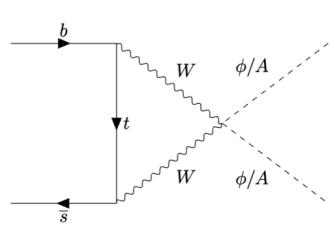

text_image

b
W φ/A
t
W φ/A
s

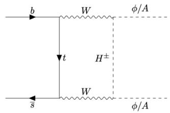

chemical

Feynman diagram showing W boson exchange with H± and φ/A labels

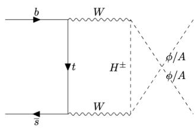

chemical

Feynman diagram showing W boson exchange with H± and φ/A labels

Figure 7. Feynman diagrams.

$$
\begin{array}{l} \xi_ {\phi \phi} ^ {i j} \simeq \xi_ {A A} ^ {i j} \simeq \frac {g ^ {2}}{6 4 \pi^ {2}} \sum_ {k} V _ {k i} ^ {*} [ f _ {0} (x _ {k}, x _ {H ^ {\pm}}) + f _ {1} (x _ {k}, x _ {H ^ {\pm}}) \log x _ {k} \\ \left. + f _ {2} \left(x _ {k}, x _ {H ^ {\pm}}\right) \log x _ {H ^ {\pm}} \right] V _ {k j} + \mathcal {O} (\cos (\beta - \alpha), 1 / \tan \beta), \tag {E.2} \\ \end{array}
$$

where the auxiliary functions $f _ { 0 , 1 , 2 } ( x _ { k } , x _ { H ^ { \pm } } )$ are given as

$$
f _ {0} (x _ {k}, x _ {H ^ {\pm}}) = - \frac {6 x _ {k} ^ {2} - x _ {k} x _ {H ^ {\pm}} (x _ {k} ^ {2} - 2 x _ {k} + 7) + 2 x _ {H ^ {\pm}} ^ {2} (x _ {k} - 1) ^ {2}}{(x _ {k} - 1) ^ {2} (x _ {H ^ {\pm}} - x _ {k})}, \tag {E.3}
$$

$$
f _ {1} (x _ {k}, x _ {H ^ {\pm}}) = - \frac {3 x _ {k} (x _ {k} + 1) - 2 x _ {H ^ {\pm}} (x _ {k} ^ {3} - 3 x _ {k} ^ {2} + 6 x _ {k} + 2) + 3 x _ {H ^ {\pm}} ^ {2} (x _ {k} ^ {2} - 3 x _ {k} + 4)}{(x _ {k} - 1) ^ {3} (x _ {H ^ {\pm}} - x _ {k}) ^ {2}}, \tag {E.4}
$$

$$
f _ {2} \left(x _ {k}, x _ {H ^ {\pm}}\right) = \frac {x _ {H ^ {\pm}} ^ {2} \left(2 x _ {H ^ {\pm}} - x _ {k}\right)}{\left(x _ {H ^ {\pm}} - x _ {k}\right) ^ {2}}, \tag {E.5}
$$

with $x _ { k } \equiv m _ { x } ^ { 2 } / m _ { W } ^ { 2 }$ and $x _ { H ^ { \pm } } \equiv m _ { H ^ { \pm } } ^ { 2 } / m _ { W } ^ { 2 }$ where $m _ { x }$ is the mass of the quark running in the loop. It is obvious in this result that except the loop suppression factor there is no other suppression, which indicates that mesons have a large branching fraction decaying into a (pseudo)scalar pair.

Following refs. [113, 201, 202], the inclusive differential decay width of b quark is

$$
\frac {d \Gamma_ {b \rightarrow s \phi \phi (s A A)}}{d q ^ {2}} = \frac {\left| \xi_ {\phi \phi (A A)} ^ {s b} \right| ^ {2}}{6 4 \pi^ {3} v ^ {4} m _ {b}} \left(1 - \frac {4 m _ {\phi (A)} ^ {2}}{q ^ {2}}\right) ^ {1 / 2} \left[ \lambda (m _ {b} ^ {2}, m _ {s} ^ {2}, q ^ {2}) \right] ^ {1 / 2} \left[ (m _ {b} - m _ {s}) ^ {2} - q ^ {2} \right], \tag {E.6}
$$

where $q ^ { 2 } = ( p _ { b } - p _ { s } ) ^ { 2 }$ . Taking the limit $m _ { s }  0$ and integrating over $q ^ { 2 }$ from $4 m _ { \phi ( A ) } ^ { 2 }$ to $m _ { b } ^ { 2 }$ we get

$$
\mathrm{Br} (b \rightarrow s \phi \phi (s A A)) = \frac {\Gamma_ {b \rightarrow s \phi \phi (s A A)}}{\Gamma_ {B}} = \frac {1}{\Gamma_ {B}} \frac {\left| \xi_ {\phi \phi (A A)} ^ {s b} \right| ^ {2} m _ {b} ^ {5}}{6 4 \pi^ {3} v ^ {4}} f \left(m _ {\phi (A)} / m _ {b}\right), \tag {E.7}
$$

where

$$
f (x) = \frac {1}{3} \sqrt {1 - 4 x ^ {2}} (1 + 5 x ^ {2} - 6 x ^ {4}) - 4 x ^ {2} (1 - 2 x ^ {2} + 2 x ^ {4}) \log \left[ \left(1 + \sqrt {1 - 4 x ^ {2}}\right) / (2 x) \right]. \tag {E.8}
$$

For $m _ { \phi ( A ) } = 1 \mathrm { G e V }$ , we obtain $\mathrm { B r } ( b \to s \phi \phi ) \simeq 3 . 0 7 \times 1 0 ^ { - 5 }$ and $\mathrm { B r } ( b \to s A A ) \simeq 6 . 8 4 \times 1 0 ^ { - 7 }$ for Light H and Light A benchmark point respectively. The branching fractions of Kaon decaying into a (pseudo)scalar pair can be estimated in a similar way. We obtain

$$
\mathrm{Br} (K \to \pi \phi \phi (\pi A A)) = \frac {1}{5 1 2 \pi^ {3} m _ {K} ^ {3} \Gamma_ {K}} \int_ {4 m _ {\phi (A)} ^ {2}} ^ {(m _ {K} - m _ {\pi}) ^ {2}} | \mathcal {M} (K \to \pi \phi \phi (\pi A A)) | ^ {2}
$$

$$
\left(1 - \frac {4 m _ {\phi (A)} ^ {2}}{q ^ {2}}\right) ^ {1 / 2} \left[ \lambda (m _ {K} ^ {2}, m _ {\pi} ^ {2}, q ^ {2}) \right] ^ {1 / 2} d q ^ {2}, \tag {E.9}
$$

where

$$
\mathcal {M} (K \to \pi \phi \phi (\pi A A)) \simeq \frac {\xi_ {\phi \phi (A A)} ^ {d s}}{v ^ {2}} m _ {s} \frac {m _ {K} ^ {2} - m _ {\pi} ^ {2}}{m _ {s} - m _ {d}} f _ {0} ^ {K ^ {\pm} \pi^ {\pm}} (q ^ {2}). \qquad \mathrm{(E.10)}
$$

For $m _ { \phi ( A ) } = 0 . 1 \mathrm { G e V }$ , we obtain $\operatorname { B r } ( K \to \pi \phi \phi ) \simeq 5 . 4 0 \times 1 0 ^ { - 1 1 }$ and $\operatorname { B r } ( K \to \pi A A ) \simeq$ 1.43 × 10−12 for CP-even and CP-odd benchmark point respectively. In figure 8, we show how the branching fraction changes with scalar mass.

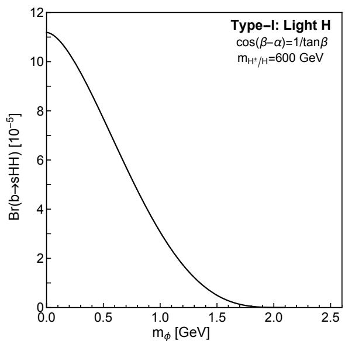

line

| m_φ [GeV] | Br(b→sHH) [10⁻⁵] |
| --------- | ----------------- |
| 0.0       | 11.0              |
| 0.5       | 8.0               |
| 1.0       | 4.0               |
| 1.5       | 1.0               |
| 2.0       | 0.1               |
| 2.5       | 0.0               |

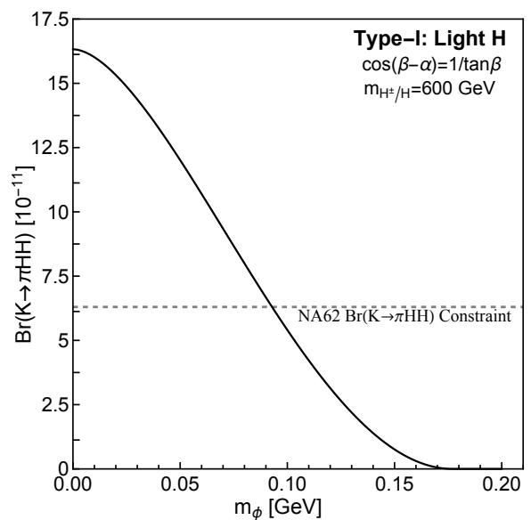

line

| m_φ [GeV] | Br(K→πHH) [10⁻¹¹] |
| --------- | ----------------- |
| 0.00      | 16.5              |
| 0.05      | 13.0              |
| 0.10      | 8.0               |
| 0.15      | 3.0               |
| 0.20      | 0.0               |

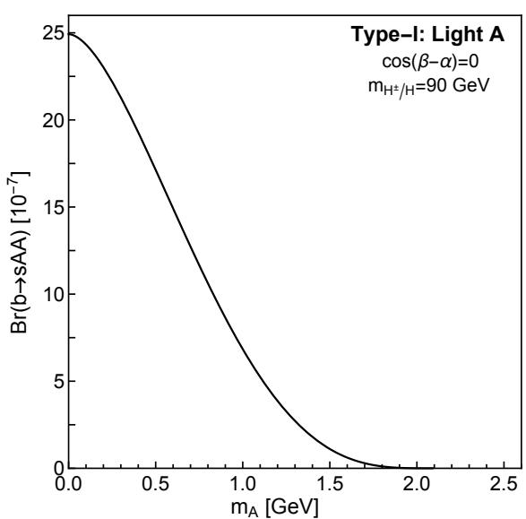

line

| m_A [GeV] | Br(b→sAA) [10⁻⁷] |
| --------- | ---------------- |
| 0.0       | 25.0             |
| 0.5       | 18.0             |
| 1.0       | 10.0             |
| 1.5       | 3.0              |
| 2.0       | 0.5              |
| 2.5       | 0.1              |

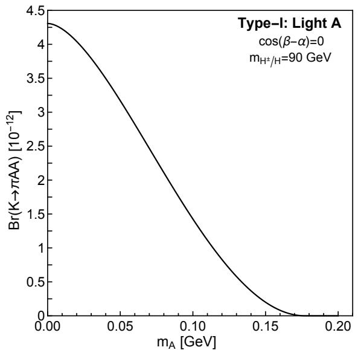

line

| mA [GeV] | Br(K→πAA) [10⁻¹²] |
| -------- | ----------------- |
| 0.00     | 4.3               |
| 0.05     | 3.5               |
| 0.10     | 2.0               |
| 0.15     | 0.5               |
| 0.20     | 0.0               |

Figure 8. The branching fractions for (pseudo)scalar pair production from b quark and Kaon decays in two different benchmark cases. The horizontal dash gray line in the upper right panel shows the NA62 constraint on branching ratio of $K  \pi H H$ assuming the Standard Model K → πνν¯ branching fraction of $( 8 . 4 \pm 1 . 0 ) \times 1 0 ^ { - 1 1 }$ . Such NA62 limit in other panels or LEP limit on $b \to s H H ( s A A )$ ) are not shown since the experimental limits are above the predicted range of branching fractions.

Open Access. This article is distributed under the terms of the Creative Commons Attribution License (CC-BY 4.0), which permits any use, distribution and reproduction in any medium, provided the original author(s) and source are credited.

# References

[1] Y. Gershtein, CMS Hardware Track Trigger: New Opportunities for Long-Lived Particle Searches at the HL-LHC, Phys. Rev. D 96 (2017) 035027 [arXiv:1705.04321] [INSPIRE].   
[2] J. Liu, Z. Liu and L.-T. Wang, Enhancing Long-Lived Particles Searches at the LHC with Precision Timing Information, Phys. Rev. Lett. 122 (2019) 131801 [arXiv:1805.05957] [INSPIRE].   
[3] L. Lee, C. Ohm, A. Soffer and T.-T. Yu, Collider Searches for Long-Lived Particles Beyond the Standard Model, Prog. Part. Nucl. Phys. 106 (2019) 210 [Erratum ibid. 122 (2022) 103912] [arXiv:1810.12602] [INSPIRE].   
[4] J. Alimena et al., Searching for long-lived particles beyond the Standard Model at the Large Hadron Collider, J. Phys. G 47 (2020) 090501 [arXiv:1903.04497] [INSPIRE].   
[5] J. Liu, Z. Liu, L.-T. Wang and X.-P. Wang, Seeking for sterile neutrinos with displaced leptons at the LHC, JHEP 07 (2019) 159 [arXiv:1904.01020] [INSPIRE].   
[6] J. Liu, Z. Liu, L.-T. Wang and X.-P. Wang, Enhancing Sensitivities to Long-lived Particles with High Granularity Calorimeters at the LHC, JHEP 11 (2020) 066 [arXiv:2005.10836] [INSPIRE].   
[7] Y. Gershtein, S. Knapen and D. Redigolo, Probing naturally light singlets with a displaced vertex trigger, Phys. Lett. B 823 (2021) 136758 [arXiv:2012.07864] [INSPIRE].   
[8] W.H. Chiu, Z. Liu, M. Low and L.-T. Wang, Jet timing, JHEP 01 (2022) 014 [arXiv:2109.01682] [INSPIRE].   
[9] O. Fischer et al., Unveiling hidden physics at the LHC, Eur. Phys. J. C 82 (2022) 665 [arXiv:2109.06065] [INSPIRE].   
[10] T. Bose et al., Report of the Topical Group on Physics Beyond the Standard Model at Energy Frontier for Snowmass 2021, arXiv:2209.13128 [INSPIRE].   
[11] ATLAS collaboration, Search for heavy, long-lived, charged particles with large ionisation energy loss in pp collisions at s = 13 TeV using the ATLAS experiment and the full Run 2 dataset, JHEP 2306 (2023) 158 [arXiv:2205.06013] [INSPIRE].   
[12] ATLAS collaboration, Search for heavy long-lived multi-charged particles in the full Run-II pp collision data at s = 13 TeV using the ATLAS detector, ATLAS-CONF-2022-034 (2022) [INSPIRE].   
[13] CMS collaboration, Search for heavy stable charged particles with 12.9 f b−1 of 2016 data, CMS-PAS-EXO-16-036 (2016) [INSPIRE].   
[14] CMS collaboration, Search for long-lived particles that decay into final states containing two muons, reconstructed using only the CMS muon chambers, CMS-PAS-EXO-14-012 (2015) [INSPIRE].   
[15] CMS collaboration, Search for long-lived particles decaying to a pair of muons in proton-proton collisions at $\sqrt { s } = 1 3 \ T e V ,$ JHEP 05 (2023) 228 [arXiv:2205.08582] [INSPIRE].

[16] ATLAS collaboration, Search for long-lived particles in final states with displaced dimuon vertices in pp collisions at $\sqrt { s } = 1 3 \ T e V$ with the ATLAS detector, Phys. Rev. D 99 (2019) 012001 [arXiv:1808.03057] [INSPIRE].   
[17] CMS collaboration, Search for decays of stopped exotic long-lived particles produced in proton-proton collisions at $\sqrt { s } = 1 3 \ T e V ,$ JHEP 05 (2018) 127 [arXiv:1801.00359] [INSPIRE].   
[18] ATLAS collaboration, Search for neutral long-lived particles in pp collisions at $\sqrt { s } = 1 3 \ T e V$ that decay into displaced hadronic jets in the ATLAS calorimeter, JHEP 06 (2022) 005 [arXiv:2203.01009] [INSPIRE].   
[19] CMS collaboration, Search for long-lived particles using displaced jets in proton-proton collisions at $\sqrt { s } = 1 3 ~ T e V , ~ P h y s$ . Rev. D 104 (2021) 012015 [arXiv:2012.01581] [INSPIRE].   
[20] ATLAS collaboration, A search for the decays of stopped long-lived particles at $\sqrt { s } = 1  { \mathcal { S } } T e V$ with the ATLAS detector, JHEP 07 (2021) 173 [arXiv:2104.03050] [INSPIRE].   
[21] CMS collaboration, Search for long-lived particles using delayed photons in proton-proton collisions at $\sqrt { s } = 1 3 \ T e V ,$ Phys. Rev. D 100 (2019) 112003 [arXiv:1909.06166] [INSPIRE].   
[22] CMS collaboration, Search for long-lived particles using nonprompt jets and missing transverse momentum with proton-proton collisions at ${ \sqrt { s } } = 1 3 \ T e V ,$ Phys. Lett. B 797 (2019) 134876 [arXiv:1906.06441] [INSPIRE].   
[23] ATLAS collaboration, Search for long-lived neutral particles in pp collisions at $\sqrt { s } = 1 3 \ T e V$ that decay into displaced hadronic jets in the ATLAS calorimeter, Eur. Phys. J. C 79 (2019) 481 [arXiv:1902.03094] [INSPIRE].   
[24] CMS collaboration, Search for long-lived particles decaying into muon pairs in proton-proton collisions at $\sqrt { s } = 1 3$ TeV collected with a dedicated high-rate data stream, JHEP 04 (2022) 062 [arXiv:2112.13769] [INSPIRE].   
[25] ATLAS collaboration, Search in diphoton and dielectron final states for displaced production of Higgs or Z bosons with the ATLAS detector in $\sqrt { s } = 1 3$ TeV pp collisions, ATLAS-CONF-2022-051 (2022) [INSPIRE].   
[26] ATLAS collaboration, Measurement of the charge asymmetry in top quark pair production in association with a photon with the ATLAS experiment, ATLAS-CONF-2022-049 (2022) [INSPIRE].   
[27] J.P. Chou, D. Curtin and H.J. Lubatti, New Detectors to Explore the Lifetime Frontier, Phys. Lett. B 767 (2017) 29 [arXiv:1606.06298] [INSPIRE].   
[28] D. Curtin and M.E. Peskin, Analysis of Long Lived Particle Decays with the MATHUSLA Detector, Phys. Rev. D 97 (2018) 015006 [arXiv:1705.06327] [INSPIRE].   
[29] J.A. Evans, Detecting Hidden Particles with MATHUSLA, Phys. Rev. D 97 (2018) 055046 [arXiv:1708.08503] [INSPIRE].   
[30] D. Curtin et al., Long-Lived Particles at the Energy Frontier: The MATHUSLA Physics Case, Rept. Prog. Phys. 82 (2019) 116201 [arXiv:1806.07396] [INSPIRE].   
[31] D. Curtin, K.R. Dienes and B. Thomas, Dynamical Dark Matter, MATHUSLA, and the Lifetime Frontier, Phys. Rev. D 98 (2018) 115005 [arXiv:1809.11021] [INSPIRE].   
[32] A. Berlin and F. Kling, Inelastic Dark Matter at the LHC Lifetime Frontier: ATLAS, CMS, LHCb, CODEX-b, FASER, and MATHUSLA, Phys. Rev. D 99 (2019) 015021 [arXiv:1810.01879] [INSPIRE].

[33] MATHUSLA collaboration, A Letter of Intent for MATHUSLA: A Dedicated Displaced Vertex Detector above ATLAS or CMS, arXiv:1811.00927 [INSPIRE].   
[34] MATHUSLA collaboration, Explore the lifetime frontier with MATHUSLA, 2020 JINST 15 C06026 [arXiv:1901.04040] [INSPIRE].   
[35] K. Jodłowski, F. Kling, L. Roszkowski and S. Trojanowski, Extending the reach of FASER, MATHUSLA, and SHiP towards smaller lifetimes using secondary particle production, Phys. Rev. D 101 (2020) 095020 [arXiv:1911.11346] [INSPIRE].   
[36] M. Alidra et al., The MATHUSLA test stand, Nucl. Instrum. Meth. A 985 (2021) 164661 [arXiv:2005.02018] [INSPIRE].   
[37] MATHUSLA collaboration, An Update to the Letter of Intent for MATHUSLA: Search for Long-Lived Particles at the HL-LHC, arXiv:2009.01693 [INSPIRE].   
[38] MATHUSLA collaboration, Recent Progress and Next Steps for the MATHUSLA LLP Detector, in the proceedings of the Snowmass 2021, Seattle U.S.A., July 17–26 (2022) [arXiv:2203.08126] [INSPIRE].   
[39] V.V. Gligorov, S. Knapen, M. Papucci and D.J. Robinson, Searching for Long-lived Particles: A Compact Detector for Exotics at LHCb, Phys. Rev. D 97 (2018) 015023 [arXiv:1708.09395] [INSPIRE].   
[40] B. Dey, J. Lee, V. Coco and C.-S. Moon, Background studies for the CODEX-b experiment: measurements and simulation, arXiv:1912.03846 [INSPIRE].   
[41] G. Aielli et al., Expression of interest for the CODEX-b detector, Eur. Phys. J. C 80 (2020) 1177 [arXiv:1911.00481] [INSPIRE].   
[42] G. Aielli et al., The Road Ahead for CODEX-b, arXiv:2203.07316 [INSPIRE].   
[43] M. Bauer, O. Brandt, L. Lee and C. Ohm, ANUBIS: Proposal to search for long-lived neutral particles in CERN service shafts, arXiv:1909.13022 [INSPIRE].   
[44] M. Hirsch and Z.S. Wang, Heavy neutral leptons at ANUBIS, Phys. Rev. D 101 (2020) 055034 [arXiv:2001.04750] [INSPIRE].   
[45] H.K. Dreiner, J.Y. Günther and Z.S. Wang, R-parity violation and light neutralinos at ANUBIS and MAPP, Phys. Rev. D 103 (2021) 075013 [arXiv:2008.07539] [INSPIRE].   
[46] D. Egana-Ugrinovic, S. Homiller and P. Meade, Light Scalars and the Koto Anomaly, Phys. Rev. Lett. 124 (2020) 191801 [arXiv:1911.10203] [INSPIRE].   
[47] T. Kitahara et al., New physics implications of recent search for $K _ { L }  \pi ^ { 0 } \nu \bar { \nu }$ at KOTO, Phys. Rev. Lett. 124 (2020) 071801 [arXiv:1909.11111] [INSPIRE].   
[48] J. Liu, N. McGinnis, C.E.M. Wagner and X.-P. Wang, A light scalar explanation of (g − 2)µ and the KOTO anomaly, JHEP 04 (2020) 197 [arXiv:2001.06522] [INSPIRE].   
[49] F. Kling and S. Trojanowski, Looking forward to test the KOTO anomaly with FASER, Phys. Rev. D 102 (2020) 015032 [arXiv:2006.10630] [INSPIRE].   
[50] S. Baum, M. Carena, N.R. Shah and C.E.M. Wagner, The tiny (g − 2) muon wobble from small-µ supersymmetry, JHEP 01 (2022) 025 [arXiv:2104.03302] [INSPIRE].   
[51] P. Athron et al., New physics explanations of aµ in light of the FNAL muon g − 2 measurement, JHEP 09 (2021) 080 [arXiv:2104.03691] [INSPIRE].   
[52] D. Tucker-Smith and N. Weiner, Inelastic dark matter, Phys. Rev. D 64 (2001) 043502 [hep-ph/0101138] [INSPIRE].

[53] K.R. Dienes and B. Thomas, Dynamical Dark Matter: I. Theoretical Overview, Phys. Rev. D 85 (2012) 083523 [arXiv:1106.4546] [INSPIRE].   
[54] K.R. Dienes and B. Thomas, Dynamical Dark Matter: II. An Explicit Model, Phys. Rev. D 85 (2012) 083524 [arXiv:1107.0721] [INSPIRE].   
[55] K.R. Dienes and B. Thomas, Phenomenological Constraints on Axion Models of Dynamical Dark Matter, Phys. Rev. D 86 (2012) 055013 [arXiv:1203.1923] [INSPIRE].   
[56] Y. Hochberg, E. Kuflik and H. Murayama, SIMP Spectroscopy, JHEP 05 (2016) 090 [arXiv:1512.07917] [INSPIRE].   
[57] B. Barman and A. Ghoshal, Scale invariant FIMP miracle, JCAP 03 (2022) 003 [arXiv:2109.03259] [INSPIRE].   
[58] B. Barman and A. Ghoshal, Probing pre-BBN era with scale invariant FIMP, JCAP 10 (2022) 082 [arXiv:2203.13269] [INSPIRE].   
[59] M.J. Strassler and K.M. Zurek, Echoes of a hidden valley at hadron colliders, Phys. Lett. B 651 (2007) 374 [hep-ph/0604261] [INSPIRE].   
[60] M.J. Strassler and K.M. Zurek, Discovering the Higgs through highly-displaced vertices, Phys. Lett. B 661 (2008) 263 [hep-ph/0605193] [INSPIRE].   
[61] B. Holdom, Two U(1)’s and Epsilon Charge Shifts, Phys. Lett. B 166 (1986) 196 [INSPIRE].   
[62] M. Bauer, P. Foldenauer and J. Jaeckel, Hunting All the Hidden Photons, JHEP 07 (2018) 094 [arXiv:1803.05466] [INSPIRE].   
[63] M. Fabbrichesi, E. Gabrielli and G. Lanfranchi, The Dark Photon, arXiv:2005.01515 [DOI:10.1007/978-3-030-62519-1] [INSPIRE].   
[64] A. Caputo, A.J. Millar, C.A.J. O’Hare and E. Vitagliano, Dark photon limits: A handbook, Phys. Rev. D 104 (2021) 095029 [arXiv:2105.04565] [INSPIRE].   
[65] R.D. Peccei and H.R. Quinn, CP Conservation in the Presence of Instantons, Phys. Rev. Lett. 38 (1977) 1440 [INSPIRE].   
[66] R.D. Peccei and H.R. Quinn, Constraints Imposed by CP Conservation in the Presence of Instantons, Phys. Rev. D 16 (1977) 1791 [INSPIRE].   
[67] J. Jaeckel and A. Ringwald, The Low-Energy Frontier of Particle Physics, Ann. Rev. Nucl. Part. Sci. 60 (2010) 405 [arXiv:1002.0329] [INSPIRE].   
[68] M. Bauer, M. Neubert and A. Thamm, Collider Probes of Axion-Like Particles, JHEP 12 (2017) 044 [arXiv:1708.00443] [INSPIRE].   
[69] M. Gell-Mann, P. Ramond and R. Slansky, Complex Spinors and Unified Theories, Conf. Proc. C 790927 (1979) 315 [arXiv:1306.4669] [INSPIRE].   
[70] R.N. Mohapatra and G. Senjanovic, Neutrino Mass and Spontaneous Parity Nonconservation, Phys. Rev. Lett. 44 (1980) 912 [INSPIRE].   
[71] J. Schechter and J.W.F. Valle, Neutrino Masses in SU(2) × U(1) Theories, Phys. Rev. D 22 (1980) 2227 [INSPIRE].   
[72] T. Asaka and M. Shaposhnikov, The νMSM, dark matter and baryon asymmetry of the universe, Phys. Lett. B 620 (2005) 17 [hep-ph/0505013] [INSPIRE].   
[73] J. Kersten and A.Y. Smirnov, Right-Handed Neutrinos at CERN LHC and the Mechanism of Neutrino Mass Generation, Phys. Rev. D 76 (2007) 073005 [arXiv:0705.3221] [INSPIRE].

[74] M. Drewes and B. Garbrecht, Combining experimental and cosmological constraints on heavy neutrinos, Nucl. Phys. B 921 (2017) 250 [arXiv:1502.00477] [INSPIRE].   
[75] Belle-II collaboration, Belle II Technical Design Report, arXiv:1011.0352 [INSPIRE].   
[76] Belle-II collaboration, The Belle II Physics Book, PTEP 2019 (2019) 123C01 [Erratum ibid. 2020 (2020) 029201] [arXiv:1808.10567] [INSPIRE].   
[77] A. Filimonova, R. Schäfer and S. Westhoff, Probing dark sectors with long-lived particles at BELLE II, Phys. Rev. D 101 (2020) 095006 [arXiv:1911.03490] [INSPIRE].   
[78] C.-Y. Chen, M. Pospelov and Y.-M. Zhong, Muon Beam Experiments to Probe the Dark Sector, Phys. Rev. D 95 (2017) 115005 [arXiv:1701.07437] [INSPIRE].   
[79] L. Marsicano et al., Probing Leptophilic Dark Sectors at Electron Beam-Dump Facilities, Phys. Rev. D 98 (2018) 115022 [arXiv:1812.03829] [INSPIRE].   
[80] HPS collaboration, The Heavy Photon Search experiment at Jefferson Laboratory, J. Phys. Conf. Ser. 556 (2014) 012064 [arXiv:1505.02025] [INSPIRE].   
[81] HPS collaboration, Search for a dark photon in electroproduced e+e− pairs with the Heavy Photon Search experiment at JLab, Phys. Rev. D 98 (2018) 091101 [arXiv:1807.11530] [INSPIRE].   
[82] HPS collaboration, Search for a Dark Photon in Electro-Produced e+e− Pairs with the Heavy Photon Search Experiment at JLab, PoS ICHEP2018 (2019) 076 [arXiv:1812.02169] [INSPIRE].   
[83] NA62 collaboration, Search for Hidden Sector particles at NA62, PoS EPS-HEP2017 (2017) 301 [INSPIRE].   
[84] NA62 collaboration, The Beam and detector of the NA62 experiment at CERN, 2017 JINST 12 P05025 [arXiv:1703.08501] [INSPIRE].   
[85] NA64 collaboration, Search for invisible decays of sub-GeV dark photons in missing-energy events at the CERN SPS, Phys. Rev. Lett. 118 (2017) 011802 [arXiv:1610.02988] [INSPIRE].   
[86] S.N. Gninenko, D.V. Kirpichnikov, M.M. Kirsanov and N.V. Krasnikov, Combined search for light dark matter with electron and muon beams at NA64, Phys. Lett. B 796 (2019) 117 [arXiv:1903.07899] [INSPIRE].   
[87] D. Banerjee et al., Dark matter search in missing energy events with NA64, Phys. Rev. Lett. 123 (2019) 121801 [arXiv:1906.00176] [INSPIRE].   
[88] NA64 collaboration, Search for Axionlike and Scalar Particles with the NA64 Experiment, Phys. Rev. Lett. 125 (2020) 081801 [arXiv:2005.02710] [INSPIRE].   
[89] S. Gninenko, Addendum to the NA64 Proposal: Search for the A0 → invisible and $X  e ^ { + } e ^ { - }$ decays in 2021, CERN-SPSC-2018-004, CERN, Geneva (2018).   
[90] NA64 collaboration, Addendum to the Proposal P348: Search for dark sector particles weakly coupled to muon with NA64 µ, CERN-SPSC-2018-024, CERN, Geneva (2018).   
[91] SeaQuest collaboration, The SeaQuest Spectrometer at Fermilab, Nucl. Instrum. Meth. A 930 (2019) 49 [arXiv:1706.09990] [INSPIRE].   
[92] M.X. Liu, Prospects of direct search for dark photon and dark Higgs in SeaQuest/E1067 experiment at the Fermilab main injector, Mod. Phys. Lett. A 32 (2017) 1730008 [INSPIRE].   
[93] A. Berlin, S. Gori, P. Schuster and N. Toro, Dark Sectors at the Fermilab SeaQuest Experiment, Phys. Rev. D 98 (2018) 035011 [arXiv:1804.00661] [INSPIRE].

[94] B. Batell, J.A. Evans, S. Gori and M. Rai, Dark Scalars and Heavy Neutral Leptons at DarkQuest, JHEP 05 (2021) 049 [arXiv:2008.08108] [INSPIRE].   
[95] N. Blinov, E. Kowalczyk and M. Wynne, Axion-like particle searches at DarkQuest, JHEP 02 (2022) 036 [arXiv:2112.09814] [INSPIRE].   
[96] A. Apyan et al., DarkQuest: A dark sector upgrade to SpinQuest at the 120 GeV Fermilab Main Injector, in the proceedings of the Snowmass 2021, Seattle U.S.A., July 17–26 (2022) [arXiv:2203.08322] [INSPIRE].   
[97] Y.-D. Tsai, P. deNiverville and M.X. Liu, Dark Photon and Muon g − 2 Inspired Inelastic Dark Matter Models at the High-Energy Intensity Frontier, Phys. Rev. Lett. 126 (2021) 181801 [arXiv:1908.07525] [INSPIRE].   
[98] W. Bonivento et al., Proposal to Search for Heavy Neutral Leptons at the SPS, arXiv:1310.1762 [INSPIRE].   
[99] S. Alekhin et al., A facility to Search for Hidden Particles at the CERN SPS: the SHiP physics case, Rept. Prog. Phys. 79 (2016) 124201 [arXiv:1504.04855] [INSPIRE].   
[100] SHiP collaboration, A facility to Search for Hidden Particles (SHiP) at the CERN SPS, arXiv:1504.04956 [INSPIRE].   
[101] J.L. Feng, I. Galon, F. Kling and S. Trojanowski, ForwArd Search ExpeRiment at the LHC, Phys. Rev. D 97 (2018) 035001 [arXiv:1708.09389] [INSPIRE].   
[102] FASER collaboration, Letter of Intent for FASER: ForwArd Search ExpeRiment at the LHC, arXiv:1811.10243 [INSPIRE].   
[103] FASER collaboration, Technical Proposal for FASER: ForwArd Search ExpeRiment at the LHC, arXiv:1812.09139 [INSPIRE].   
[104] FASER collaboration, The FASER Detector, arXiv:2207.11427 [INSPIRE].   
[105] FASER collaboration, The tracking detector of the FASER experiment, Nucl. Instrum. Meth. A 1034 (2022) 166825 [arXiv:2112.01116] [INSPIRE].   
[106] FASER collaboration, The trigger and data acquisition system of the FASER experiment, 2021 JINST 16 P12028 [arXiv:2110.15186] [INSPIRE].   
[107] FASER collaboration, FASER’s physics reach for long-lived particles, Phys. Rev. D 99 (2019) 095011 [arXiv:1811.12522] [INSPIRE].   
[108] S. Demidov, D. Gorbunov and D. Kalashnikov, Sgoldstino signal at FASER: prospects in searches for supersymmetry, JHEP 08 (2022) 155 [arXiv:2202.05190] [INSPIRE].   
[109] J.L. Feng, I. Galon, F. Kling and S. Trojanowski, Axionlike particles at FASER: The LHC as a photon beam dump, Phys. Rev. D 98 (2018) 055021 [arXiv:1806.02348] [INSPIRE].   
[110] F. Kling and S. Trojanowski, Heavy Neutral Leptons at FASER, Phys. Rev. D 97 (2018) 095016 [arXiv:1801.08947] [INSPIRE].   
[111] L.A. Anchordoqui et al., The Forward Physics Facility: Sites, experiments, and physics potential, Phys. Rept. 968 (2022) 1 [arXiv:2109.10905] [INSPIRE].   
[112] J.L. Feng et al., The Forward Physics Facility at the High-Luminosity LHC, J. Phys. G 50 (2023) 030501 [arXiv:2203.05090] [INSPIRE].   
[113] J.L. Feng, I. Galon, F. Kling and S. Trojanowski, Dark Higgs bosons at the ForwArd Search ExpeRiment, Phys. Rev. D 97 (2018) 055034 [arXiv:1710.09387] [INSPIRE].

[114] F. Kling and S. Trojanowski, Forward experiment sensitivity estimator for the LHC and future hadron colliders, Phys. Rev. D 104 (2021) 035012 [arXiv:2105.07077] [INSPIRE].   
[115] Light scalar decay, https://github.com/shiggs90/Light\_scalar\_decay.git.   
[116] A. Cherchiglia, D. Stöckinger and H. Stöckinger-Kim, Muon g-2 in the 2HDM: maximum results and detailed phenomenology, Phys. Rev. D 98 (2018) 035001 [arXiv:1711.11567] [INSPIRE].   
[117] F. Domingo, Decays of a NMSSM CP-odd Higgs in the low-mass region, JHEP 03 (2017) 052 [arXiv:1612.06538] [INSPIRE].   
[118] Particle Data Group collaboration, Review of Particle Physics, PTEP 2020 (2020) 083C01 [INSPIRE].   
[119] Particle Data Group collaboration, Review of Particle Physics, Phys. Rev. D 98 (2018) 030001 [INSPIRE].   
[120] A. Djouadi, The Anatomy of electro-weak symmetry breaking. I: The Higgs boson in the standard model, Phys. Rept. 457 (2008) 1 [hep-ph/0503172] [INSPIRE].   
[121] F. Fugel, B.A. Kniehl and M. Steinhauser, Two loop electroweak correction of $O ( G _ { F } M _ { t } ^ { 2 } )$ to the Higgs-boson decay into photons, Nucl. Phys. B 702 (2004) 333 [hep-ph/0405232] [INSPIRE].   
[122] I. Boiarska et al., Phenomenology of GeV-scale scalar portal, JHEP 11 (2019) 162 [arXiv:1904.10447] [INSPIRE].   
[123] H. Leutwyler and M.A. Shifman, Light Higgs Particle in Decays of K and η Mesons, Nucl. Phys. B 343 (1990) 369 [INSPIRE].   
[124] J.F. Gunion, H.E. Haber, G.L. Kane and S. Dawson, The Higgs Hunter’s Guide, CRC Press (2000) [INSPIRE].   
[125] R.S. Chivukula and A.V. Manohar, Limits on a light Higgs boson, Phys. Lett. B 207 (1988) 86 [Erratum ibid. 217 (1989) 568] [INSPIRE].   
[126] B. Grinstein, L.J. Hall and L. Randall, Do B meson decays exclude a light Higgs?, Phys. Lett. B 211 (1988) 363 [INSPIRE].   
[127] S. Dawson, Higgs Boson Production in Semileptonic K and π Decays, Phys. Lett. B 222 (1989) 143 [INSPIRE].   
[128] M.W. Winkler, Decay and detection of a light scalar boson mixing with the Higgs boson, Phys. Rev. D 99 (2019) 015018 [arXiv:1809.01876] [INSPIRE].   
[129] F. Bezrukov and D. Gorbunov, Light inflaton Hunter’s Guide, JHEP 05 (2010) 010 [arXiv:0912.0390] [INSPIRE].   
[130] B. Batell, A. Freitas, A. Ismail and D. Mckeen, Probing Light Dark Matter with a Hadrophilic Scalar Mediator, Phys. Rev. D 100 (2019) 095020 [arXiv:1812.05103] [INSPIRE].   
[131] H.-Y. Cheng and H.-L. Yu, Are There Really No Experimental Limits on a Light Higgs Boson From Kaon Decay?, Phys. Rev. D 40 (1989) 2980 [INSPIRE].   
[132] J.R. Ellis, K. Enqvist, D.V. Nanopoulos and S. Ritz, Light Higgs Bosons and Supersymmetry, Phys. Lett. B 158 (1985) 417 [Erratum ibid. 163 (1985) 408] [INSPIRE].   
[133] J.F. Donoghue, J. Gasser and H. Leutwyler, The Decay of a Light Higgs Boson, Nucl. Phys. B 343 (1990) 341 [INSPIRE].

[134] A. Monin, A. Boyarsky and O. Ruchayskiy, Hadronic decays of a light Higgs-like scalar, Phys. Rev. D 99 (2019) 015019 [arXiv:1806.07759] [INSPIRE].   
[135] S. Bethke, Experimental tests of asymptotic freedom, Prog. Part. Nucl. Phys. 58 (2007) 351 [hep-ex/0606035] [INSPIRE].   
[136] A. Djouadi, The Anatomy of electro-weak symmetry breaking. II. The Higgs bosons in the minimal supersymmetric model, Phys. Rept. 459 (2008) 1 [hep-ph/0503173] [INSPIRE].   
[137] M.J. Dolan, F. Kahlhoefer, C. McCabe and K. Schmidt-Hoberg, A taste of dark matter: Flavour constraints on pseudoscalar mediators, JHEP 03 (2015) 171 [Erratum ibid. 07 (2015) 103] [arXiv:1412.5174] [INSPIRE].   
[138] L.J. Hall and M.B. Wise, Flavor changing Higgs boson couplings, Nucl. Phys. B 187 (1981) 397 [INSPIRE].   
[139] J.M. Frere, J.A.M. Vermaseren and M.B. Gavela, The Elusive Axion, Phys. Lett. B 103 (1981) 129 [INSPIRE].   
[140] M. Freytsis, Z. Ligeti and J. Thaler, Constraining the Axion Portal with B → Kl+l−, Phys. Rev. D 81 (2010) 034001 [arXiv:0911.5355] [INSPIRE].   
[141] B. Batell, M. Pospelov and A. Ritz, Multi-lepton Signatures of a Hidden Sector in Rare B Decays, Phys. Rev. D 83 (2011) 054005 [arXiv:0911.4938] [INSPIRE].   
[142] A. Ali, P. Ball, L.T. Handoko and G. Hiller, A Comparative study of the decays B → (K, K∗)\`+\`− in standard model and supersymmetric theories, Phys. Rev. D 61 (2000) 074024 [hep-ph/9910221] [INSPIRE].   
[143] BESIII collaboration, Search for a CP -odd light Higgs boson in $J / \psi  \gamma A ^ { 0 } .$ , Phys. Rev. D 105 (2022) 012008 [arXiv:2109.12625] [INSPIRE].   
[144] F. Domingo, Updated constraints from radiative Υ decays on a light CP-odd Higgs, JHEP 04 (2011) 016 [arXiv:1010.4701] [INSPIRE].   
[145] M. Beneke, A. Signer and V.A. Smirnov, Two loop correction to the leptonic decay of quarkonium, Phys. Rev. Lett. 80 (1998) 2535 [hep-ph/9712302] [INSPIRE].   
[146] D. McKeen, Constraining Light Bosons with Radiative Υ(1S) Decays, Phys. Rev. D 79 (2009) 015007 [arXiv:0809.4787] [INSPIRE].   
[147] B.R. Holstein, Allowed eta decay modes and chiral symmetry, Phys. Scripta T 99 (2002) 55 [hep-ph/0112150] [INSPIRE].   
[148] M.A.B. Beg and A. Zepeda, Pion radius and isovector nucleon radii in the limit of small pion mass, Phys. Rev. D 6 (1972) 2912 [INSPIRE].   
[149] E.P. Venugopal and B.R. Holstein, Chiral anomaly and η − η0 mixing, Phys. Rev. D 57 (1998) 4397 [hep-ph/9710382] [INSPIRE].   
[150] G.C. Branco et al., Theory and phenomenology of two-Higgs-doublet models, Phys. Rept. 516 (2012) 1 [arXiv:1106.0034] [INSPIRE].   
[151] F. Kling, J.M. No and S. Su, Anatomy of Exotic Higgs Decays in 2HDM, JHEP 09 (2016) 093 [arXiv:1604.01406] [INSPIRE].   
[152] N. Chen et al., Type-I 2HDM under the Higgs and Electroweak Precision Measurements, JHEP 08 (2020) 131 [arXiv:1912.01431] [INSPIRE].   
[153] W. Su, Probing loop effects in wrong-sign Yukawa coupling region of Type-II 2HDM, Eur. Phys. J. C 81 (2021) 404 [arXiv:1910.06269] [INSPIRE].

[154] J. Haller et al., Update of the global electroweak fit and constraints on two-Higgs-doublet models, Eur. Phys. J. C 78 (2018) 675 [arXiv:1803.01853] [INSPIRE].   
[155] J. Gu et al., Learning from Higgs Physics at Future Higgs Factories, JHEP 12 (2017) 153 [arXiv:1709.06103] [INSPIRE].   
[156] N. Chen et al., Type-II 2HDM under the Precision Measurements at the Z-pole and a Higgs Factory, JHEP 03 (2019) 023 [arXiv:1808.02037] [INSPIRE].   
[157] ALEPH et al. collaborations, Search for Charged Higgs bosons: Combined Results Using LEP Data, Eur. Phys. J. C 73 (2013) 2463 [arXiv:1301.6065] [INSPIRE].   
[158] O. Atkinson et al., Cornering the Two Higgs Doublet Model Type II, JHEP 04 (2022) 172 [arXiv:2107.05650] [INSPIRE].   
[159] M. Misiak, A. Rehman and M. Steinhauser, Towards $\overline { { B } }  X _ { s } \gamma$ at the NNLO in QCD without interpolation in $m _ { c } , J H E P$ 06 (2020) 175 [arXiv:2002.01548] [INSPIRE].   
[160] CMS collaboration, Searches for invisible decays of the Higgs boson in pp collisions at ${ \sqrt { s } } = 7 ,$ , 8, and 13 TeV, JHEP 02 (2017) 135 [arXiv:1610.09218] [INSPIRE].   
[161] ATLAS collaboration, Search for invisible decays of a Higgs boson using vector-boson fusion in pp collisions at $\sqrt { s } = 8 \ T e V$ with the ATLAS detector, JHEP 01 (2016) 172 [arXiv:1508.07869] [INSPIRE].   
[162] ATLAS collaboration, Search for an invisibly decaying Higgs boson or dark matter candidates produced in association with a Z boson in pp collisions at $\sqrt { s } = 1 3 \ T e V$ with the ATLAS detector, Phys. Lett. B 776 (2018) 318 [arXiv:1708.09624] [INSPIRE].   
[163] T. Biekötter and M. Pierre, Higgs-boson visible and invisible constraints on hidden sectors, Eur. Phys. J. C 82 (2022) 1026 [arXiv:2208.05505] [INSPIRE].   
[164] ATLAS collaboration, Search for $H ^ { \pm } \to W ^ { \pm } A \to W ^ { \pm } \mu \mu$ in $p p  t { \bar { t } }$ events using an eµµ signature with the ATLAS detector at $\sqrt { s } = 1 3 \ T e V , \mathrm { A T L A S - C O N F - 2 0 2 1 - 0 4 7 \ ( 2 0 2 1 ) }$ [INSPIRE].   
[165] ATLAS collaboration, Search for charged Higgs bosons decaying via $H ^ { \pm }  \tau ^ { \pm } \nu _ { \tau }$ in the τ +jets and τ +lepton final states with $3 6 f b ^ { - 1 }$ of pp collision data recorded at $\sqrt { s } = 1 3 \ T e V$ with the ATLAS experiment, JHEP 09 (2018) 139 [arXiv:1807.07915] [INSPIRE].   
[166] CMS collaboration, Search for charged Higgs bosons in the $H ^ { \pm }  \tau ^ { \pm } \nu _ { \tau }$ decay channel in proton-proton collisions at $\sqrt { s } = 1 3 \ T e V ,$ JHEP 07 (2019) 142 [arXiv:1903.04560] [INSPIRE].   
[167] CMS collaboration, Search for a light charged Higgs boson decaying to a W boson and a CP-odd Higgs boson in final states with eµµ or µµµ in proton-proton collisions at $\sqrt { s } = 1 3 \ T e V ,$ Phys. Rev. Lett. 123 (2019) 131802 [arXiv:1905.07453] [INSPIRE].   
[168] K. Cheung et al., Comprehensive study of the light charged Higgs boson in the type-I two-Higgs-doublet model, Phys. Rev. D 105 (2022) 095044 [arXiv:2201.06890] [INSPIRE].   
[169] Y.L. Hu, C.H. Fu and J. Gao, Signature of a light charged Higgs boson from top quark pairs at the LHC, Phys. Rev. D 106 (2022) L071701 [arXiv:2206.05748] [INSPIRE].   
[170] CHARM collaboration, Search for Axion Like Particle Production in 400-GeV Proton-Copper Interactions, Phys. Lett. B 157 (1985) 458 [INSPIRE].   
[171] D. Gorbunov, I. Krasnov and S. Suvorov, Constraints on light scalars from PS191 results, Phys. Lett. B 820 (2021) 136524 [arXiv:2105.11102] [INSPIRE].

[172] M.S. Turner, Axions from SN 1987a, Phys. Rev. Lett. 60 (1988) 1797 [INSPIRE].   
[173] J.R. Ellis and K.A. Olive, Constraints on Light Particles From Supernova Sn1987a, Phys. Lett. B 193 (1987) 525 [INSPIRE].   
[174] G. Krnjaic, Probing Light Thermal Dark-Matter With a Higgs Portal Mediator, Phys. Rev. D 94 (2016) 073009 [arXiv:1512.04119] [INSPIRE].   
[175] B. Batell, J. Berger and A. Ismail, Probing the Higgs Portal at the Fermilab Short-Baseline Neutrino Experiments, Phys. Rev. D 100 (2019) 115039 [arXiv:1909.11670] [INSPIRE].   
[176] P.S.B. Dev, R.N. Mohapatra and Y. Zhang, Revisiting supernova constraints on a light CP-even scalar, JCAP 08 (2020) 003 [Erratum ibid. 11 (2020) E01] [arXiv:2005.00490] [INSPIRE].   
[177] S. Balaji, P.S.B. Dev, J. Silk and Y. Zhang, Improved stellar limits on a light CP-even scalar, JCAP 12 (2022) 024 [arXiv:2205.01669] [INSPIRE].   
[178] LHCb collaboration, Search for hidden-sector bosons in $B ^ { 0 } { \to } K ^ { * 0 } \mu ^ { + } \mu ^ { - }$ decays, Phys. Rev. Lett. 115 (2015) 161802 [arXiv:1508.04094] [INSPIRE].   
[179] LHCb collaboration, Search for long-lived scalar particles in $B ^ { + } \to K ^ { + } \chi ( \mu ^ { + } \mu ^ { - } )$ decays, Phys. Rev. D 95 (2017) 071101 [arXiv:1612.07818] [INSPIRE].   
[180] BaBar collaboration, Search for $B \to K ^ { ( * ) }$ νν and invisible quarkonium decays, Phys. Rev. D 87 (2013) 112005 [arXiv:1303.7465] [INSPIRE].   
[181] NA62 collaboration, Measurement of the very rare $K ^ { + } \to \pi ^ { + } \nu \overline { { \nu } }$ decay, JHEP 06 (2021) 093 [arXiv:2103.15389] [INSPIRE].   
[182] MicroBooNE collaboration, Search for a Higgs Portal Scalar Decaying to Electron-Positron Pairs in the MicroBooNE Detector, Phys. Rev. Lett. 127 (2021) 151803 [arXiv:2106.00568] [INSPIRE].   
[183] BNL-E949 collaboration, Study of the decay $K ^ { + }  \pi ^ { + } \nu \bar { \nu }$ in the momentum region $1 4 0 < P _ { \pi } < 1 9 9 M e V / c ,$ Phys. Rev. D 79 (2009) 092004 [arXiv:0903.0030] [INSPIRE].   
[184] Particle Data Group collaboration, Review of Particle Physics, PTEP 2022 (2022) 083C01 [INSPIRE].   
[185] LHCb collaboration, Searches for 25 rare and forbidden decays of $D ^ { + }$ and $D _ { s } ^ { + }$ mesons, JHEP 06 (2021) 044 [arXiv:2011.00217] [INSPIRE].   
[186] L3 collaboration, Search for neutral Higgs boson production through the process $e ^ { + } e ^ { - } \to Z ^ { * }$ H0, Phys. Lett. B 385 (1996) 454 [INSPIRE].   
[187] ALEPH collaboration, Search for a nonminimal Higgs boson produced in the reaction $e ^ { + } e ^ { - } \to h Z ^ { * }$ , Phys. Lett. B 313 (1993) 312 [INSPIRE].   
[188] OPAL collaboration, Search for invisibly decaying Higgs bosons in $e ^ { + } e ^ { - } \to Z 0 h 0$ production at $\sqrt { s } = 1 8 3 - 2 0 9 \ G e V , \ P h y s .$ . Lett. B 682 (2010) 381 [arXiv:0707.0373] [INSPIRE].   
[189] J.D. Clarke, R. Foot and R.R. Volkas, Phenomenology of a very light scalar (100 $M e V < m _ { h } < 1 0 G e V )$ mixing with the SM Higgs, JHEP 02 (2014) 123 [arXiv:1310.8042] [INSPIRE].   
[190] B. Döbrich, F. Ertas, F. Kahlhoefer and T. Spadaro, Model-independent bounds on light pseudoscalars from rare B-meson decays, Phys. Lett. B 790 (2019) 537 [arXiv:1810.11336] [INSPIRE].

[191] FASER collaboration, First Results from the Search for Dark Photons with the FASER Detector at the LHC, CERN-FASER-CONF-2023-001, CERN, Geneva (2023).   
[192] J. Boyd, The FASER W-Si High Precision Preshower Technical Proposal, CERN-LHCC-2022-006, CERN, Geneva (2022).   
[193] G. Eilam, B. Haeri and A. Soni, Flavor changing Higgs transitions, Phys. Rev. D 41 (1990) 875 [INSPIRE].   
[194] X.-Q. Li, J. Lu and A. Pich, $B _ { s , d } ^ { 0 } \to \ell ^ { + } \ell ^ { - }$ Decays in the Aligned Two-Higgs-Doublet Model, JHEP 06 (2014) 022 [arXiv:1404.5865] [INSPIRE].   
[195] X.-D. Cheng, Y.-D. Yang and X.-B. Yuan, Revisiting $B _ { s } \to \mu ^ { + } \mu ^ { - }$ in the two-Higgs doublet models with Z2 symmetry, Eur. Phys. J. C 76 (2016) 151 [arXiv:1511.01829] [INSPIRE].   
[196] P. Arnan, D. Bečirević, F. Mescia and O. Sumensari, Two Higgs doublet models and $b  s$ exclusive decays, Eur. Phys. J. C 77 (2017) 796 [arXiv:1703.03426] [INSPIRE].   
[197] T. Pierog et al., EPOS LHC: Test of collective hadronization with data measured at the CERN Large Hadron Collider, Phys. Rev. C 92 (2015) 034906 [arXiv:1306.0121] [INSPIRE].   
[198] R. Ulrich, T. Pierog and C. Baus, Cosmic Ray Monte Carlo Package, CRMC, DOI:10.5281/zenodo.5270381.   
[199] T. Sjostrand, S. Mrenna and P.Z. Skands, A Brief Introduction to PYTHIA 8.1, Comput. Phys. Commun. 178 (2008) 852 [arXiv:0710.3820] [INSPIRE].   
[200] T. Han et al., Comparative Studies of 2HDMs under the Higgs Boson Precision Measurements, JHEP 01 (2021) 045 [arXiv:2008.05492] [INSPIRE].   
[201] C. Bird, P. Jackson, R.V. Kowalewski and M. Pospelov, Search for dark matter in b → s transitions with missing energy, Phys. Rev. Lett. 93 (2004) 201803 [hep-ph/0401195] [INSPIRE].   
[202] W. Altmannshofer, A.J. Buras, D.M. Straub and M. Wick, New strategies for New Physics search in B → K∗νν¯, B → Kνν¯ and $B \to X _ { s } \nu \bar { \nu }$ decays, JHEP 04 (2009) 022 [arXiv:0902.0160] [INSPIRE].